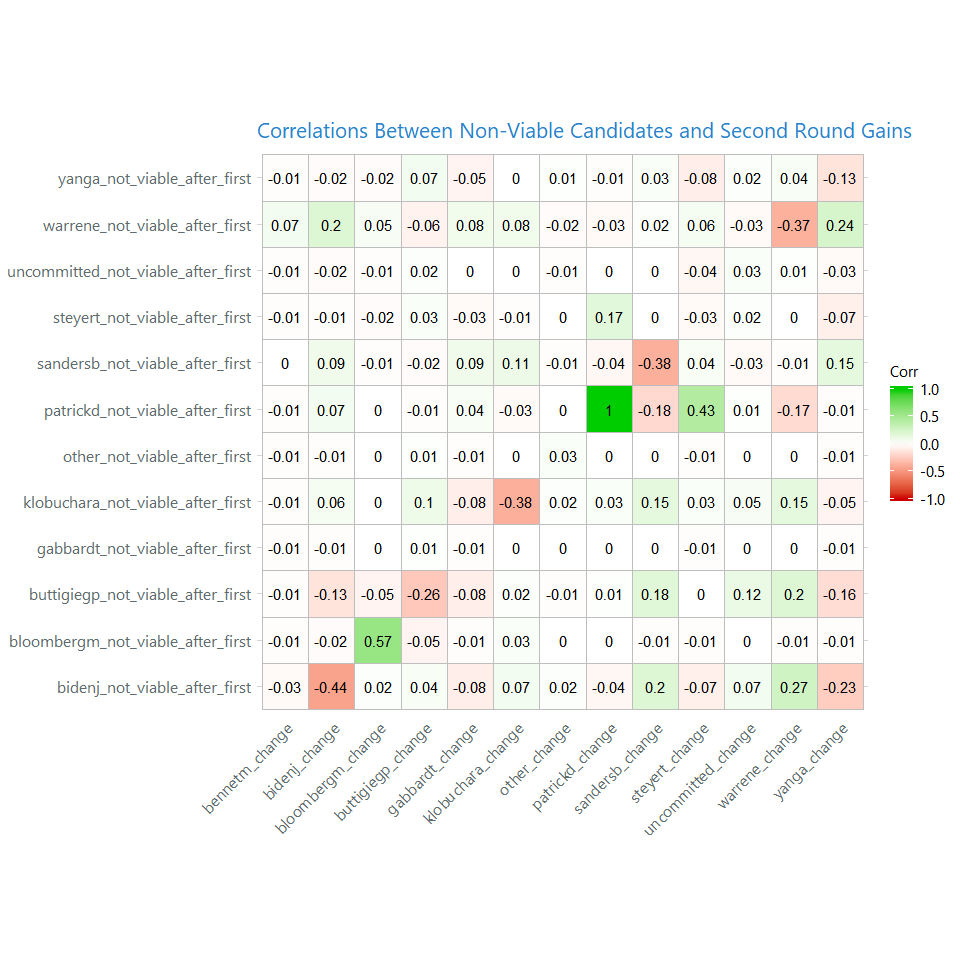

    library(rvest)
    library(tidyverse)
    library(tidycensus)
    library(httr)
    library(reshape2)

    source("./theme_powerbi.R")

    # Pull in precinct data from NYT latest endpoint

    precincts <- GET("https://int.nyt.com/applications/elections/2020/data/api/2020-02-03/precincts/IowaDemPrecinctsSFTP-latest.json") %>% content()

    precincts <- precincts$precincts %>% 
      map_if(negate(is.list), function(x) flatten_chr(x)) %>% 
      enframe()

    results <- precincts$value %>% map("results") %>% bind_rows()
    results_first_alignment <- precincts$value %>% map("results_align1") %>% bind_rows()
    results_final_alignment <- precincts$value %>% map("results_alignfinal") %>% bind_rows()

    ## Ugly but doing it on the fly
    precinct_details <- precincts$value %>% 
      map(function(x) keep(x, negate(is.list))) %>% 
      map(bind_rows) %>% map(sapply, as.character) %>% 
      map(bind_rows) %>% bind_rows()

    precinct_details <- precinct_details %>% 
      mutate(precinct = paste0(precinct, "-", precinct_id))

    precinct_names <- precinct_details %>% 
      select(precinct, is_complete)

    ## Combine first alignment results with precinct details
    first_alignment_results <- results_first_alignment %>% bind_cols(precinct_names) %>%
      melt(id.vars = c("precinct", "is_complete")) %>% rename(candidate = variable, votes_first = value) %>%
      group_by(precinct) %>% mutate(total_first = sum(votes_first)) %>%
      group_by(precinct, candidate) %>% mutate(percent_first = votes_first/total_first) %>%
      mutate(candidate_not_viable_first = ifelse(percent_first < .15, TRUE, FALSE)) %>%
      group_by(candidate) %>%
      ungroup() 

    ## Same same with final results
    final_alignment_results <- results_final_alignment %>% bind_cols(precinct_names)  %>%
      melt(id.vars = c("precinct", "is_complete")) %>% rename(candidate = variable, votes_final = value) %>%
      group_by(precinct) %>% mutate(total_final = sum(votes_final)) %>%
      group_by(precinct, candidate) %>% mutate(percent_final = votes_final/total_final) %>%
      mutate(candidate_viable_final = ifelse(percent_final > .15, TRUE, FALSE)) %>%
      ungroup() 

    results_full <- first_alignment_results %>%
      left_join(final_alignment_results, by = c("precinct", "candidate", "is_complete")) %>%
      mutate(change_from_first = votes_final - votes_first)

    viability <- results_full %>% filter(is_complete == "TRUE") %>%
      select(precinct, candidate, candidate_not_viable_first) %>%
      mutate(candidate = paste0(candidate, "_not_viable_after_first")) %>%
      dcast(precinct ~ candidate)

    change_between_rounds <- results_full %>% 
      filter(is_complete == "TRUE") %>%
      select(precinct, candidate, change_from_first) %>%
      mutate(candidate = paste0(candidate, "_change")) %>%
      dcast(precinct~candidate)

Iowa Weirdness
--------------

I noticed some strange data discrepancies between the precinct level
vote counts in the first and final alignment of the Iowa Caucus. These
are:

-   Indianola 2 - (precinct == “IN2-948050”) in the data
-   Deval Patrick’s 41 votes apparently moving to Bernie Sanders in
    final round, with Bernie having 0 in the first
-   Tom Steyer’s 50 votes moving to Elizabeth Warren in the final round,
    with Warren having 0 in the first
-   Council Bluffs 12 - (precinct == “CB 12-947794”)
-   Michael Bloomberg’s 24 votes moving to Buttigieg in the final round,
    with Buttigieg having 0 in the first

These observations and others with similar patterns (that I have not had
the time to fully validate) are available in the table below. Feel free
to snoop and update the thread with anything you see.

    ## Coded few conditions that might be of interest.
    results_full %>% 
      group_by(precinct) %>% 
      mutate(unviable_to_viable = ifelse((candidate_not_viable_first & candidate_viable_final & 
                                            !candidate %in% c("other", "uncommitted")), TRUE, FALSE),
             viable_to_unviable = ifelse((!candidate_not_viable_first & !candidate_viable_final & 
                                            !candidate %in% c("other", "uncommitted")), TRUE, FALSE),
             zero_votes_to_nonzero_votes = ifelse((votes_first == 0 & votes_final > 0), TRUE, FALSE),
             viable_to_zero_votes = ifelse((!candidate_not_viable_first & votes_final == 0 & 
                                              !candidate %in% c("other", "uncommitted")), TRUE, FALSE)) %>%
      group_by(precinct) %>% arrange(precinct, candidate) %>% 
      mutate(mickey_mouse_shit = ifelse((zero_votes_to_nonzero_votes|viable_to_zero_votes), TRUE, FALSE)) %>%
                      group_by(precinct) %>%  
      mutate(precincts_with_mms = max(mickey_mouse_shit)) %>% 
      filter(precincts_with_mms == 1) %>% 
      arrange(precinct, candidate) %>% 
      select(viable_to_zero_votes, zero_votes_to_nonzero_votes, viable_to_unviable,
             unviable_to_viable, everything()) %>% 
      filter(viable_to_zero_votes & !candidate %in% c("other", "uncommitted")) %>% 
      knitr::kable(caption = "Cases of Viable Candidates Receiving 0 Votes in Final Tally")

<table>
<caption>Cases of Viable Candidates Receiving 0 Votes in Final Tally</caption>
<thead>
<tr class="header">
<th style="text-align: left;">viable_to_zero_votes</th>
<th style="text-align: left;">zero_votes_to_nonzero_votes</th>
<th style="text-align: left;">viable_to_unviable</th>
<th style="text-align: left;">unviable_to_viable</th>
<th style="text-align: left;">precinct</th>
<th style="text-align: left;">is_complete</th>
<th style="text-align: left;">candidate</th>
<th style="text-align: right;">votes_first</th>
<th style="text-align: right;">total_first</th>
<th style="text-align: right;">percent_first</th>
<th style="text-align: left;">candidate_not_viable_first</th>
<th style="text-align: right;">votes_final</th>
<th style="text-align: right;">total_final</th>
<th style="text-align: right;">percent_final</th>
<th style="text-align: left;">candidate_viable_final</th>
<th style="text-align: right;">change_from_first</th>
<th style="text-align: left;">mickey_mouse_shit</th>
<th style="text-align: right;">precincts_with_mms</th>
</tr>
</thead>
<tbody>
<tr class="odd">
<td style="text-align: left;">TRUE</td>
<td style="text-align: left;">FALSE</td>
<td style="text-align: left;">TRUE</td>
<td style="text-align: left;">FALSE</td>
<td style="text-align: left;">1 BA-LS-1593688</td>
<td style="text-align: left;">TRUE</td>
<td style="text-align: left;">warrene</td>
<td style="text-align: right;">5</td>
<td style="text-align: right;">28</td>
<td style="text-align: right;">0.1785714</td>
<td style="text-align: left;">FALSE</td>
<td style="text-align: right;">0</td>
<td style="text-align: right;">28</td>
<td style="text-align: right;">0</td>
<td style="text-align: left;">FALSE</td>
<td style="text-align: right;">-5</td>
<td style="text-align: left;">TRUE</td>
<td style="text-align: right;">1</td>
</tr>
<tr class="even">
<td style="text-align: left;">TRUE</td>
<td style="text-align: left;">FALSE</td>
<td style="text-align: left;">TRUE</td>
<td style="text-align: left;">FALSE</td>
<td style="text-align: left;">12-946730</td>
<td style="text-align: left;">TRUE</td>
<td style="text-align: left;">klobuchara</td>
<td style="text-align: right;">5</td>
<td style="text-align: right;">20</td>
<td style="text-align: right;">0.2500000</td>
<td style="text-align: left;">FALSE</td>
<td style="text-align: right;">0</td>
<td style="text-align: right;">20</td>
<td style="text-align: right;">0</td>
<td style="text-align: left;">FALSE</td>
<td style="text-align: right;">-5</td>
<td style="text-align: left;">TRUE</td>
<td style="text-align: right;">1</td>
</tr>
<tr class="odd">
<td style="text-align: left;">TRUE</td>
<td style="text-align: left;">FALSE</td>
<td style="text-align: left;">TRUE</td>
<td style="text-align: left;">FALSE</td>
<td style="text-align: left;">13-947157</td>
<td style="text-align: left;">TRUE</td>
<td style="text-align: left;">buttigiegp</td>
<td style="text-align: right;">8</td>
<td style="text-align: right;">37</td>
<td style="text-align: right;">0.2162162</td>
<td style="text-align: left;">FALSE</td>
<td style="text-align: right;">0</td>
<td style="text-align: right;">29</td>
<td style="text-align: right;">0</td>
<td style="text-align: left;">FALSE</td>
<td style="text-align: right;">-8</td>
<td style="text-align: left;">TRUE</td>
<td style="text-align: right;">1</td>
</tr>
<tr class="even">
<td style="text-align: left;">TRUE</td>
<td style="text-align: left;">FALSE</td>
<td style="text-align: left;">TRUE</td>
<td style="text-align: left;">FALSE</td>
<td style="text-align: left;">2-947146</td>
<td style="text-align: left;">TRUE</td>
<td style="text-align: left;">sandersb</td>
<td style="text-align: right;">7</td>
<td style="text-align: right;">42</td>
<td style="text-align: right;">0.1666667</td>
<td style="text-align: left;">FALSE</td>
<td style="text-align: right;">0</td>
<td style="text-align: right;">42</td>
<td style="text-align: right;">0</td>
<td style="text-align: left;">FALSE</td>
<td style="text-align: right;">-7</td>
<td style="text-align: left;">TRUE</td>
<td style="text-align: right;">1</td>
</tr>
<tr class="odd">
<td style="text-align: left;">TRUE</td>
<td style="text-align: left;">FALSE</td>
<td style="text-align: left;">TRUE</td>
<td style="text-align: left;">FALSE</td>
<td style="text-align: left;">2-947842</td>
<td style="text-align: left;">TRUE</td>
<td style="text-align: left;">klobuchara</td>
<td style="text-align: right;">1</td>
<td style="text-align: right;">5</td>
<td style="text-align: right;">0.2000000</td>
<td style="text-align: left;">FALSE</td>
<td style="text-align: right;">0</td>
<td style="text-align: right;">5</td>
<td style="text-align: right;">0</td>
<td style="text-align: left;">FALSE</td>
<td style="text-align: right;">-1</td>
<td style="text-align: left;">TRUE</td>
<td style="text-align: right;">1</td>
</tr>
<tr class="even">
<td style="text-align: left;">TRUE</td>
<td style="text-align: left;">FALSE</td>
<td style="text-align: left;">TRUE</td>
<td style="text-align: left;">FALSE</td>
<td style="text-align: left;">2-947842</td>
<td style="text-align: left;">TRUE</td>
<td style="text-align: left;">warrene</td>
<td style="text-align: right;">1</td>
<td style="text-align: right;">5</td>
<td style="text-align: right;">0.2000000</td>
<td style="text-align: left;">FALSE</td>
<td style="text-align: right;">0</td>
<td style="text-align: right;">5</td>
<td style="text-align: right;">0</td>
<td style="text-align: left;">FALSE</td>
<td style="text-align: right;">-1</td>
<td style="text-align: left;">TRUE</td>
<td style="text-align: right;">1</td>
</tr>
<tr class="odd">
<td style="text-align: left;">TRUE</td>
<td style="text-align: left;">FALSE</td>
<td style="text-align: left;">TRUE</td>
<td style="text-align: left;">FALSE</td>
<td style="text-align: left;">24-947957</td>
<td style="text-align: left;">TRUE</td>
<td style="text-align: left;">bidenj</td>
<td style="text-align: right;">19</td>
<td style="text-align: right;">112</td>
<td style="text-align: right;">0.1696429</td>
<td style="text-align: left;">FALSE</td>
<td style="text-align: right;">0</td>
<td style="text-align: right;">93</td>
<td style="text-align: right;">0</td>
<td style="text-align: left;">FALSE</td>
<td style="text-align: right;">-19</td>
<td style="text-align: left;">TRUE</td>
<td style="text-align: right;">1</td>
</tr>
<tr class="even">
<td style="text-align: left;">TRUE</td>
<td style="text-align: left;">FALSE</td>
<td style="text-align: left;">TRUE</td>
<td style="text-align: left;">FALSE</td>
<td style="text-align: left;">3 GC-947480</td>
<td style="text-align: left;">TRUE</td>
<td style="text-align: left;">warrene</td>
<td style="text-align: right;">5</td>
<td style="text-align: right;">27</td>
<td style="text-align: right;">0.1851852</td>
<td style="text-align: left;">FALSE</td>
<td style="text-align: right;">0</td>
<td style="text-align: right;">27</td>
<td style="text-align: right;">0</td>
<td style="text-align: left;">FALSE</td>
<td style="text-align: right;">-5</td>
<td style="text-align: left;">TRUE</td>
<td style="text-align: right;">1</td>
</tr>
<tr class="odd">
<td style="text-align: left;">TRUE</td>
<td style="text-align: left;">FALSE</td>
<td style="text-align: left;">TRUE</td>
<td style="text-align: left;">FALSE</td>
<td style="text-align: left;">30-947964</td>
<td style="text-align: left;">TRUE</td>
<td style="text-align: left;">bidenj</td>
<td style="text-align: right;">16</td>
<td style="text-align: right;">87</td>
<td style="text-align: right;">0.1839080</td>
<td style="text-align: left;">FALSE</td>
<td style="text-align: right;">0</td>
<td style="text-align: right;">83</td>
<td style="text-align: right;">0</td>
<td style="text-align: left;">FALSE</td>
<td style="text-align: right;">-16</td>
<td style="text-align: left;">TRUE</td>
<td style="text-align: right;">1</td>
</tr>
<tr class="even">
<td style="text-align: left;">TRUE</td>
<td style="text-align: left;">FALSE</td>
<td style="text-align: left;">TRUE</td>
<td style="text-align: left;">FALSE</td>
<td style="text-align: left;">31-947965</td>
<td style="text-align: left;">TRUE</td>
<td style="text-align: left;">bidenj</td>
<td style="text-align: right;">18</td>
<td style="text-align: right;">106</td>
<td style="text-align: right;">0.1698113</td>
<td style="text-align: left;">FALSE</td>
<td style="text-align: right;">0</td>
<td style="text-align: right;">88</td>
<td style="text-align: right;">0</td>
<td style="text-align: left;">FALSE</td>
<td style="text-align: right;">-18</td>
<td style="text-align: left;">TRUE</td>
<td style="text-align: right;">1</td>
</tr>
<tr class="odd">
<td style="text-align: left;">TRUE</td>
<td style="text-align: left;">FALSE</td>
<td style="text-align: left;">TRUE</td>
<td style="text-align: left;">FALSE</td>
<td style="text-align: left;">34-947968</td>
<td style="text-align: left;">TRUE</td>
<td style="text-align: left;">klobuchara</td>
<td style="text-align: right;">7</td>
<td style="text-align: right;">43</td>
<td style="text-align: right;">0.1627907</td>
<td style="text-align: left;">FALSE</td>
<td style="text-align: right;">0</td>
<td style="text-align: right;">43</td>
<td style="text-align: right;">0</td>
<td style="text-align: left;">FALSE</td>
<td style="text-align: right;">-7</td>
<td style="text-align: left;">TRUE</td>
<td style="text-align: right;">1</td>
</tr>
<tr class="even">
<td style="text-align: left;">TRUE</td>
<td style="text-align: left;">FALSE</td>
<td style="text-align: left;">TRUE</td>
<td style="text-align: left;">FALSE</td>
<td style="text-align: left;">35-947969</td>
<td style="text-align: left;">TRUE</td>
<td style="text-align: left;">sandersb</td>
<td style="text-align: right;">7</td>
<td style="text-align: right;">37</td>
<td style="text-align: right;">0.1891892</td>
<td style="text-align: left;">FALSE</td>
<td style="text-align: right;">0</td>
<td style="text-align: right;">37</td>
<td style="text-align: right;">0</td>
<td style="text-align: left;">FALSE</td>
<td style="text-align: right;">-7</td>
<td style="text-align: left;">TRUE</td>
<td style="text-align: right;">1</td>
</tr>
<tr class="odd">
<td style="text-align: left;">TRUE</td>
<td style="text-align: left;">FALSE</td>
<td style="text-align: left;">TRUE</td>
<td style="text-align: left;">FALSE</td>
<td style="text-align: left;">36-948169</td>
<td style="text-align: left;">TRUE</td>
<td style="text-align: left;">buttigiegp</td>
<td style="text-align: right;">4</td>
<td style="text-align: right;">25</td>
<td style="text-align: right;">0.1600000</td>
<td style="text-align: left;">FALSE</td>
<td style="text-align: right;">0</td>
<td style="text-align: right;">18</td>
<td style="text-align: right;">0</td>
<td style="text-align: left;">FALSE</td>
<td style="text-align: right;">-4</td>
<td style="text-align: left;">TRUE</td>
<td style="text-align: right;">1</td>
</tr>
<tr class="even">
<td style="text-align: left;">TRUE</td>
<td style="text-align: left;">FALSE</td>
<td style="text-align: left;">TRUE</td>
<td style="text-align: left;">FALSE</td>
<td style="text-align: left;">36-948169</td>
<td style="text-align: left;">TRUE</td>
<td style="text-align: left;">warrene</td>
<td style="text-align: right;">6</td>
<td style="text-align: right;">25</td>
<td style="text-align: right;">0.2400000</td>
<td style="text-align: left;">FALSE</td>
<td style="text-align: right;">0</td>
<td style="text-align: right;">18</td>
<td style="text-align: right;">0</td>
<td style="text-align: left;">FALSE</td>
<td style="text-align: right;">-6</td>
<td style="text-align: left;">TRUE</td>
<td style="text-align: right;">1</td>
</tr>
<tr class="odd">
<td style="text-align: left;">TRUE</td>
<td style="text-align: left;">FALSE</td>
<td style="text-align: left;">TRUE</td>
<td style="text-align: left;">FALSE</td>
<td style="text-align: left;">37-946977</td>
<td style="text-align: left;">TRUE</td>
<td style="text-align: left;">warrene</td>
<td style="text-align: right;">5</td>
<td style="text-align: right;">33</td>
<td style="text-align: right;">0.1515152</td>
<td style="text-align: left;">FALSE</td>
<td style="text-align: right;">0</td>
<td style="text-align: right;">33</td>
<td style="text-align: right;">0</td>
<td style="text-align: left;">FALSE</td>
<td style="text-align: right;">-5</td>
<td style="text-align: left;">TRUE</td>
<td style="text-align: right;">1</td>
</tr>
<tr class="even">
<td style="text-align: left;">TRUE</td>
<td style="text-align: left;">FALSE</td>
<td style="text-align: left;">TRUE</td>
<td style="text-align: left;">FALSE</td>
<td style="text-align: left;">41-947976</td>
<td style="text-align: left;">TRUE</td>
<td style="text-align: left;">buttigiegp</td>
<td style="text-align: right;">17</td>
<td style="text-align: right;">87</td>
<td style="text-align: right;">0.1954023</td>
<td style="text-align: left;">FALSE</td>
<td style="text-align: right;">0</td>
<td style="text-align: right;">86</td>
<td style="text-align: right;">0</td>
<td style="text-align: left;">FALSE</td>
<td style="text-align: right;">-17</td>
<td style="text-align: left;">TRUE</td>
<td style="text-align: right;">1</td>
</tr>
<tr class="odd">
<td style="text-align: left;">TRUE</td>
<td style="text-align: left;">FALSE</td>
<td style="text-align: left;">TRUE</td>
<td style="text-align: left;">FALSE</td>
<td style="text-align: left;">42-947977</td>
<td style="text-align: left;">TRUE</td>
<td style="text-align: left;">buttigiegp</td>
<td style="text-align: right;">2</td>
<td style="text-align: right;">9</td>
<td style="text-align: right;">0.2222222</td>
<td style="text-align: left;">FALSE</td>
<td style="text-align: right;">0</td>
<td style="text-align: right;">9</td>
<td style="text-align: right;">0</td>
<td style="text-align: left;">FALSE</td>
<td style="text-align: right;">-2</td>
<td style="text-align: left;">TRUE</td>
<td style="text-align: right;">1</td>
</tr>
<tr class="even">
<td style="text-align: left;">TRUE</td>
<td style="text-align: left;">FALSE</td>
<td style="text-align: left;">TRUE</td>
<td style="text-align: left;">FALSE</td>
<td style="text-align: left;">42-947977</td>
<td style="text-align: left;">TRUE</td>
<td style="text-align: left;">sandersb</td>
<td style="text-align: right;">2</td>
<td style="text-align: right;">9</td>
<td style="text-align: right;">0.2222222</td>
<td style="text-align: left;">FALSE</td>
<td style="text-align: right;">0</td>
<td style="text-align: right;">9</td>
<td style="text-align: right;">0</td>
<td style="text-align: left;">FALSE</td>
<td style="text-align: right;">-2</td>
<td style="text-align: left;">TRUE</td>
<td style="text-align: right;">1</td>
</tr>
<tr class="odd">
<td style="text-align: left;">TRUE</td>
<td style="text-align: left;">FALSE</td>
<td style="text-align: left;">TRUE</td>
<td style="text-align: left;">FALSE</td>
<td style="text-align: left;">42-948175</td>
<td style="text-align: left;">TRUE</td>
<td style="text-align: left;">sandersb</td>
<td style="text-align: right;">2</td>
<td style="text-align: right;">9</td>
<td style="text-align: right;">0.2222222</td>
<td style="text-align: left;">FALSE</td>
<td style="text-align: right;">0</td>
<td style="text-align: right;">9</td>
<td style="text-align: right;">0</td>
<td style="text-align: left;">FALSE</td>
<td style="text-align: right;">-2</td>
<td style="text-align: left;">TRUE</td>
<td style="text-align: right;">1</td>
</tr>
<tr class="even">
<td style="text-align: left;">TRUE</td>
<td style="text-align: left;">FALSE</td>
<td style="text-align: left;">TRUE</td>
<td style="text-align: left;">FALSE</td>
<td style="text-align: left;">43-947978</td>
<td style="text-align: left;">TRUE</td>
<td style="text-align: left;">bidenj</td>
<td style="text-align: right;">15</td>
<td style="text-align: right;">90</td>
<td style="text-align: right;">0.1666667</td>
<td style="text-align: left;">FALSE</td>
<td style="text-align: right;">0</td>
<td style="text-align: right;">63</td>
<td style="text-align: right;">0</td>
<td style="text-align: left;">FALSE</td>
<td style="text-align: right;">-15</td>
<td style="text-align: left;">TRUE</td>
<td style="text-align: right;">1</td>
</tr>
<tr class="odd">
<td style="text-align: left;">TRUE</td>
<td style="text-align: left;">FALSE</td>
<td style="text-align: left;">TRUE</td>
<td style="text-align: left;">FALSE</td>
<td style="text-align: left;">43-947978</td>
<td style="text-align: left;">TRUE</td>
<td style="text-align: left;">warrene</td>
<td style="text-align: right;">23</td>
<td style="text-align: right;">90</td>
<td style="text-align: right;">0.2555556</td>
<td style="text-align: left;">FALSE</td>
<td style="text-align: right;">0</td>
<td style="text-align: right;">63</td>
<td style="text-align: right;">0</td>
<td style="text-align: left;">FALSE</td>
<td style="text-align: right;">-23</td>
<td style="text-align: left;">TRUE</td>
<td style="text-align: right;">1</td>
</tr>
<tr class="even">
<td style="text-align: left;">TRUE</td>
<td style="text-align: left;">FALSE</td>
<td style="text-align: left;">TRUE</td>
<td style="text-align: left;">FALSE</td>
<td style="text-align: left;">5-947845</td>
<td style="text-align: left;">TRUE</td>
<td style="text-align: left;">bidenj</td>
<td style="text-align: right;">2</td>
<td style="text-align: right;">11</td>
<td style="text-align: right;">0.1818182</td>
<td style="text-align: left;">FALSE</td>
<td style="text-align: right;">0</td>
<td style="text-align: right;">11</td>
<td style="text-align: right;">0</td>
<td style="text-align: left;">FALSE</td>
<td style="text-align: right;">-2</td>
<td style="text-align: left;">TRUE</td>
<td style="text-align: right;">1</td>
</tr>
<tr class="odd">
<td style="text-align: left;">TRUE</td>
<td style="text-align: left;">FALSE</td>
<td style="text-align: left;">TRUE</td>
<td style="text-align: left;">FALSE</td>
<td style="text-align: left;">5-947845</td>
<td style="text-align: left;">TRUE</td>
<td style="text-align: left;">klobuchara</td>
<td style="text-align: right;">2</td>
<td style="text-align: right;">11</td>
<td style="text-align: right;">0.1818182</td>
<td style="text-align: left;">FALSE</td>
<td style="text-align: right;">0</td>
<td style="text-align: right;">11</td>
<td style="text-align: right;">0</td>
<td style="text-align: left;">FALSE</td>
<td style="text-align: right;">-2</td>
<td style="text-align: left;">TRUE</td>
<td style="text-align: right;">1</td>
</tr>
<tr class="even">
<td style="text-align: left;">TRUE</td>
<td style="text-align: left;">FALSE</td>
<td style="text-align: left;">TRUE</td>
<td style="text-align: left;">FALSE</td>
<td style="text-align: left;">6 LB-MI-1593700</td>
<td style="text-align: left;">TRUE</td>
<td style="text-align: left;">bidenj</td>
<td style="text-align: right;">4</td>
<td style="text-align: right;">22</td>
<td style="text-align: right;">0.1818182</td>
<td style="text-align: left;">FALSE</td>
<td style="text-align: right;">0</td>
<td style="text-align: right;">22</td>
<td style="text-align: right;">0</td>
<td style="text-align: left;">FALSE</td>
<td style="text-align: right;">-4</td>
<td style="text-align: left;">TRUE</td>
<td style="text-align: right;">1</td>
</tr>
<tr class="odd">
<td style="text-align: left;">TRUE</td>
<td style="text-align: left;">FALSE</td>
<td style="text-align: left;">TRUE</td>
<td style="text-align: left;">FALSE</td>
<td style="text-align: left;">7 MA-WA-1593701</td>
<td style="text-align: left;">TRUE</td>
<td style="text-align: left;">warrene</td>
<td style="text-align: right;">3</td>
<td style="text-align: right;">20</td>
<td style="text-align: right;">0.1500000</td>
<td style="text-align: left;">FALSE</td>
<td style="text-align: right;">0</td>
<td style="text-align: right;">20</td>
<td style="text-align: right;">0</td>
<td style="text-align: left;">FALSE</td>
<td style="text-align: right;">-3</td>
<td style="text-align: left;">TRUE</td>
<td style="text-align: right;">1</td>
</tr>
<tr class="even">
<td style="text-align: left;">TRUE</td>
<td style="text-align: left;">FALSE</td>
<td style="text-align: left;">TRUE</td>
<td style="text-align: left;">FALSE</td>
<td style="text-align: left;">AD-947268</td>
<td style="text-align: left;">TRUE</td>
<td style="text-align: left;">klobuchara</td>
<td style="text-align: right;">3</td>
<td style="text-align: right;">14</td>
<td style="text-align: right;">0.2142857</td>
<td style="text-align: left;">FALSE</td>
<td style="text-align: right;">0</td>
<td style="text-align: right;">14</td>
<td style="text-align: right;">0</td>
<td style="text-align: left;">FALSE</td>
<td style="text-align: right;">-3</td>
<td style="text-align: left;">TRUE</td>
<td style="text-align: right;">1</td>
</tr>
<tr class="odd">
<td style="text-align: left;">TRUE</td>
<td style="text-align: left;">FALSE</td>
<td style="text-align: left;">TRUE</td>
<td style="text-align: left;">FALSE</td>
<td style="text-align: left;">AD-947268</td>
<td style="text-align: left;">TRUE</td>
<td style="text-align: left;">sandersb</td>
<td style="text-align: right;">3</td>
<td style="text-align: right;">14</td>
<td style="text-align: right;">0.2142857</td>
<td style="text-align: left;">FALSE</td>
<td style="text-align: right;">0</td>
<td style="text-align: right;">14</td>
<td style="text-align: right;">0</td>
<td style="text-align: left;">FALSE</td>
<td style="text-align: right;">-3</td>
<td style="text-align: left;">TRUE</td>
<td style="text-align: right;">1</td>
</tr>
<tr class="even">
<td style="text-align: left;">TRUE</td>
<td style="text-align: left;">FALSE</td>
<td style="text-align: left;">TRUE</td>
<td style="text-align: left;">FALSE</td>
<td style="text-align: left;">AD-947443</td>
<td style="text-align: left;">TRUE</td>
<td style="text-align: left;">buttigiegp</td>
<td style="text-align: right;">3</td>
<td style="text-align: right;">11</td>
<td style="text-align: right;">0.2727273</td>
<td style="text-align: left;">FALSE</td>
<td style="text-align: right;">0</td>
<td style="text-align: right;">8</td>
<td style="text-align: right;">0</td>
<td style="text-align: left;">FALSE</td>
<td style="text-align: right;">-3</td>
<td style="text-align: left;">TRUE</td>
<td style="text-align: right;">1</td>
</tr>
<tr class="odd">
<td style="text-align: left;">TRUE</td>
<td style="text-align: left;">FALSE</td>
<td style="text-align: left;">TRUE</td>
<td style="text-align: left;">FALSE</td>
<td style="text-align: left;">AD-947443</td>
<td style="text-align: left;">TRUE</td>
<td style="text-align: left;">sandersb</td>
<td style="text-align: right;">2</td>
<td style="text-align: right;">11</td>
<td style="text-align: right;">0.1818182</td>
<td style="text-align: left;">FALSE</td>
<td style="text-align: right;">0</td>
<td style="text-align: right;">8</td>
<td style="text-align: right;">0</td>
<td style="text-align: left;">FALSE</td>
<td style="text-align: right;">-2</td>
<td style="text-align: left;">TRUE</td>
<td style="text-align: right;">1</td>
</tr>
<tr class="even">
<td style="text-align: left;">TRUE</td>
<td style="text-align: left;">FALSE</td>
<td style="text-align: left;">TRUE</td>
<td style="text-align: left;">FALSE</td>
<td style="text-align: left;">ADS-1593466</td>
<td style="text-align: left;">TRUE</td>
<td style="text-align: left;">bidenj</td>
<td style="text-align: right;">15</td>
<td style="text-align: right;">75</td>
<td style="text-align: right;">0.2000000</td>
<td style="text-align: left;">FALSE</td>
<td style="text-align: right;">0</td>
<td style="text-align: right;">75</td>
<td style="text-align: right;">0</td>
<td style="text-align: left;">FALSE</td>
<td style="text-align: right;">-15</td>
<td style="text-align: left;">TRUE</td>
<td style="text-align: right;">1</td>
</tr>
<tr class="odd">
<td style="text-align: left;">TRUE</td>
<td style="text-align: left;">FALSE</td>
<td style="text-align: left;">TRUE</td>
<td style="text-align: left;">FALSE</td>
<td style="text-align: left;">AL2-1593468</td>
<td style="text-align: left;">TRUE</td>
<td style="text-align: left;">klobuchara</td>
<td style="text-align: right;">29</td>
<td style="text-align: right;">190</td>
<td style="text-align: right;">0.1526316</td>
<td style="text-align: left;">FALSE</td>
<td style="text-align: right;">0</td>
<td style="text-align: right;">175</td>
<td style="text-align: right;">0</td>
<td style="text-align: left;">FALSE</td>
<td style="text-align: right;">-29</td>
<td style="text-align: left;">TRUE</td>
<td style="text-align: right;">1</td>
</tr>
<tr class="even">
<td style="text-align: left;">TRUE</td>
<td style="text-align: left;">FALSE</td>
<td style="text-align: left;">TRUE</td>
<td style="text-align: left;">FALSE</td>
<td style="text-align: left;">BG-947194</td>
<td style="text-align: left;">TRUE</td>
<td style="text-align: left;">buttigiegp</td>
<td style="text-align: right;">35</td>
<td style="text-align: right;">167</td>
<td style="text-align: right;">0.2095808</td>
<td style="text-align: left;">FALSE</td>
<td style="text-align: right;">0</td>
<td style="text-align: right;">68</td>
<td style="text-align: right;">0</td>
<td style="text-align: left;">FALSE</td>
<td style="text-align: right;">-35</td>
<td style="text-align: left;">TRUE</td>
<td style="text-align: right;">1</td>
</tr>
<tr class="odd">
<td style="text-align: left;">TRUE</td>
<td style="text-align: left;">FALSE</td>
<td style="text-align: left;">TRUE</td>
<td style="text-align: left;">FALSE</td>
<td style="text-align: left;">BG-947194</td>
<td style="text-align: left;">TRUE</td>
<td style="text-align: left;">warrene</td>
<td style="text-align: right;">39</td>
<td style="text-align: right;">167</td>
<td style="text-align: right;">0.2335329</td>
<td style="text-align: left;">FALSE</td>
<td style="text-align: right;">0</td>
<td style="text-align: right;">68</td>
<td style="text-align: right;">0</td>
<td style="text-align: left;">FALSE</td>
<td style="text-align: right;">-39</td>
<td style="text-align: left;">TRUE</td>
<td style="text-align: right;">1</td>
</tr>
<tr class="even">
<td style="text-align: left;">TRUE</td>
<td style="text-align: left;">FALSE</td>
<td style="text-align: left;">TRUE</td>
<td style="text-align: left;">FALSE</td>
<td style="text-align: left;">BN-946737</td>
<td style="text-align: left;">TRUE</td>
<td style="text-align: left;">klobuchara</td>
<td style="text-align: right;">3</td>
<td style="text-align: right;">12</td>
<td style="text-align: right;">0.2500000</td>
<td style="text-align: left;">FALSE</td>
<td style="text-align: right;">0</td>
<td style="text-align: right;">12</td>
<td style="text-align: right;">0</td>
<td style="text-align: left;">FALSE</td>
<td style="text-align: right;">-3</td>
<td style="text-align: left;">TRUE</td>
<td style="text-align: right;">1</td>
</tr>
<tr class="odd">
<td style="text-align: left;">TRUE</td>
<td style="text-align: left;">FALSE</td>
<td style="text-align: left;">TRUE</td>
<td style="text-align: left;">FALSE</td>
<td style="text-align: left;">BO-947088</td>
<td style="text-align: left;">TRUE</td>
<td style="text-align: left;">bidenj</td>
<td style="text-align: right;">3</td>
<td style="text-align: right;">19</td>
<td style="text-align: right;">0.1578947</td>
<td style="text-align: left;">FALSE</td>
<td style="text-align: right;">0</td>
<td style="text-align: right;">19</td>
<td style="text-align: right;">0</td>
<td style="text-align: left;">FALSE</td>
<td style="text-align: right;">-3</td>
<td style="text-align: left;">TRUE</td>
<td style="text-align: right;">1</td>
</tr>
<tr class="even">
<td style="text-align: left;">TRUE</td>
<td style="text-align: left;">FALSE</td>
<td style="text-align: left;">TRUE</td>
<td style="text-align: left;">FALSE</td>
<td style="text-align: left;">BO-947444</td>
<td style="text-align: left;">TRUE</td>
<td style="text-align: left;">klobuchara</td>
<td style="text-align: right;">4</td>
<td style="text-align: right;">19</td>
<td style="text-align: right;">0.2105263</td>
<td style="text-align: left;">FALSE</td>
<td style="text-align: right;">0</td>
<td style="text-align: right;">19</td>
<td style="text-align: right;">0</td>
<td style="text-align: left;">FALSE</td>
<td style="text-align: right;">-4</td>
<td style="text-align: left;">TRUE</td>
<td style="text-align: right;">1</td>
</tr>
<tr class="odd">
<td style="text-align: left;">TRUE</td>
<td style="text-align: left;">FALSE</td>
<td style="text-align: left;">TRUE</td>
<td style="text-align: left;">FALSE</td>
<td style="text-align: left;">CARSON-947805</td>
<td style="text-align: left;">TRUE</td>
<td style="text-align: left;">bidenj</td>
<td style="text-align: right;">3</td>
<td style="text-align: right;">16</td>
<td style="text-align: right;">0.1875000</td>
<td style="text-align: left;">FALSE</td>
<td style="text-align: right;">0</td>
<td style="text-align: right;">16</td>
<td style="text-align: right;">0</td>
<td style="text-align: left;">FALSE</td>
<td style="text-align: right;">-3</td>
<td style="text-align: left;">TRUE</td>
<td style="text-align: right;">1</td>
</tr>
<tr class="even">
<td style="text-align: left;">TRUE</td>
<td style="text-align: left;">FALSE</td>
<td style="text-align: left;">TRUE</td>
<td style="text-align: left;">FALSE</td>
<td style="text-align: left;">CB 12-947794</td>
<td style="text-align: left;">TRUE</td>
<td style="text-align: left;">bloombergm</td>
<td style="text-align: right;">24</td>
<td style="text-align: right;">119</td>
<td style="text-align: right;">0.2016807</td>
<td style="text-align: left;">FALSE</td>
<td style="text-align: right;">0</td>
<td style="text-align: right;">119</td>
<td style="text-align: right;">0</td>
<td style="text-align: left;">FALSE</td>
<td style="text-align: right;">-24</td>
<td style="text-align: left;">TRUE</td>
<td style="text-align: right;">1</td>
</tr>
<tr class="odd">
<td style="text-align: left;">TRUE</td>
<td style="text-align: left;">FALSE</td>
<td style="text-align: left;">TRUE</td>
<td style="text-align: left;">FALSE</td>
<td style="text-align: left;">CE-947196</td>
<td style="text-align: left;">TRUE</td>
<td style="text-align: left;">warrene</td>
<td style="text-align: right;">12</td>
<td style="text-align: right;">65</td>
<td style="text-align: right;">0.1846154</td>
<td style="text-align: left;">FALSE</td>
<td style="text-align: right;">0</td>
<td style="text-align: right;">65</td>
<td style="text-align: right;">0</td>
<td style="text-align: left;">FALSE</td>
<td style="text-align: right;">-12</td>
<td style="text-align: left;">TRUE</td>
<td style="text-align: right;">1</td>
</tr>
<tr class="even">
<td style="text-align: left;">TRUE</td>
<td style="text-align: left;">FALSE</td>
<td style="text-align: left;">TRUE</td>
<td style="text-align: left;">FALSE</td>
<td style="text-align: left;">CEDAR-948229</td>
<td style="text-align: left;">TRUE</td>
<td style="text-align: left;">bidenj</td>
<td style="text-align: right;">1</td>
<td style="text-align: right;">5</td>
<td style="text-align: right;">0.2000000</td>
<td style="text-align: left;">FALSE</td>
<td style="text-align: right;">0</td>
<td style="text-align: right;">5</td>
<td style="text-align: right;">0</td>
<td style="text-align: left;">FALSE</td>
<td style="text-align: right;">-1</td>
<td style="text-align: left;">TRUE</td>
<td style="text-align: right;">1</td>
</tr>
<tr class="odd">
<td style="text-align: left;">TRUE</td>
<td style="text-align: left;">FALSE</td>
<td style="text-align: left;">TRUE</td>
<td style="text-align: left;">FALSE</td>
<td style="text-align: left;">CEDAR-948229</td>
<td style="text-align: left;">TRUE</td>
<td style="text-align: left;">warrene</td>
<td style="text-align: right;">1</td>
<td style="text-align: right;">5</td>
<td style="text-align: right;">0.2000000</td>
<td style="text-align: left;">FALSE</td>
<td style="text-align: right;">0</td>
<td style="text-align: right;">5</td>
<td style="text-align: right;">0</td>
<td style="text-align: left;">FALSE</td>
<td style="text-align: right;">-1</td>
<td style="text-align: left;">TRUE</td>
<td style="text-align: right;">1</td>
</tr>
<tr class="even">
<td style="text-align: left;">TRUE</td>
<td style="text-align: left;">FALSE</td>
<td style="text-align: left;">TRUE</td>
<td style="text-align: left;">FALSE</td>
<td style="text-align: left;">CENT-946829</td>
<td style="text-align: left;">TRUE</td>
<td style="text-align: left;">warrene</td>
<td style="text-align: right;">3</td>
<td style="text-align: right;">14</td>
<td style="text-align: right;">0.2142857</td>
<td style="text-align: left;">FALSE</td>
<td style="text-align: right;">0</td>
<td style="text-align: right;">14</td>
<td style="text-align: right;">0</td>
<td style="text-align: left;">FALSE</td>
<td style="text-align: right;">-3</td>
<td style="text-align: left;">TRUE</td>
<td style="text-align: right;">1</td>
</tr>
<tr class="odd">
<td style="text-align: left;">TRUE</td>
<td style="text-align: left;">FALSE</td>
<td style="text-align: left;">TRUE</td>
<td style="text-align: left;">FALSE</td>
<td style="text-align: left;">CL-948284</td>
<td style="text-align: left;">TRUE</td>
<td style="text-align: left;">warrene</td>
<td style="text-align: right;">3</td>
<td style="text-align: right;">20</td>
<td style="text-align: right;">0.1500000</td>
<td style="text-align: left;">FALSE</td>
<td style="text-align: right;">0</td>
<td style="text-align: right;">17</td>
<td style="text-align: right;">0</td>
<td style="text-align: left;">FALSE</td>
<td style="text-align: right;">-3</td>
<td style="text-align: left;">TRUE</td>
<td style="text-align: right;">1</td>
</tr>
<tr class="even">
<td style="text-align: left;">TRUE</td>
<td style="text-align: left;">FALSE</td>
<td style="text-align: left;">TRUE</td>
<td style="text-align: left;">FALSE</td>
<td style="text-align: left;">CLAY 1-947721</td>
<td style="text-align: left;">TRUE</td>
<td style="text-align: left;">sandersb</td>
<td style="text-align: right;">12</td>
<td style="text-align: right;">72</td>
<td style="text-align: right;">0.1666667</td>
<td style="text-align: left;">FALSE</td>
<td style="text-align: right;">0</td>
<td style="text-align: right;">64</td>
<td style="text-align: right;">0</td>
<td style="text-align: left;">FALSE</td>
<td style="text-align: right;">-12</td>
<td style="text-align: left;">TRUE</td>
<td style="text-align: right;">1</td>
</tr>
<tr class="odd">
<td style="text-align: left;">TRUE</td>
<td style="text-align: left;">FALSE</td>
<td style="text-align: left;">TRUE</td>
<td style="text-align: left;">FALSE</td>
<td style="text-align: left;">CLAY 1-947721</td>
<td style="text-align: left;">TRUE</td>
<td style="text-align: left;">warrene</td>
<td style="text-align: right;">13</td>
<td style="text-align: right;">72</td>
<td style="text-align: right;">0.1805556</td>
<td style="text-align: left;">FALSE</td>
<td style="text-align: right;">0</td>
<td style="text-align: right;">64</td>
<td style="text-align: right;">0</td>
<td style="text-align: left;">FALSE</td>
<td style="text-align: right;">-13</td>
<td style="text-align: left;">TRUE</td>
<td style="text-align: right;">1</td>
</tr>
<tr class="even">
<td style="text-align: left;">TRUE</td>
<td style="text-align: left;">FALSE</td>
<td style="text-align: left;">TRUE</td>
<td style="text-align: left;">FALSE</td>
<td style="text-align: left;">CM WDM-1593777</td>
<td style="text-align: left;">TRUE</td>
<td style="text-align: left;">klobuchara</td>
<td style="text-align: right;">9</td>
<td style="text-align: right;">36</td>
<td style="text-align: right;">0.2500000</td>
<td style="text-align: left;">FALSE</td>
<td style="text-align: right;">0</td>
<td style="text-align: right;">27</td>
<td style="text-align: right;">0</td>
<td style="text-align: left;">FALSE</td>
<td style="text-align: right;">-9</td>
<td style="text-align: left;">TRUE</td>
<td style="text-align: right;">1</td>
</tr>
<tr class="odd">
<td style="text-align: left;">TRUE</td>
<td style="text-align: left;">FALSE</td>
<td style="text-align: left;">TRUE</td>
<td style="text-align: left;">FALSE</td>
<td style="text-align: left;">CROCK 2-1593721</td>
<td style="text-align: left;">TRUE</td>
<td style="text-align: left;">bidenj</td>
<td style="text-align: right;">20</td>
<td style="text-align: right;">132</td>
<td style="text-align: right;">0.1515152</td>
<td style="text-align: left;">FALSE</td>
<td style="text-align: right;">0</td>
<td style="text-align: right;">111</td>
<td style="text-align: right;">0</td>
<td style="text-align: left;">FALSE</td>
<td style="text-align: right;">-20</td>
<td style="text-align: left;">TRUE</td>
<td style="text-align: right;">1</td>
</tr>
<tr class="even">
<td style="text-align: left;">TRUE</td>
<td style="text-align: left;">FALSE</td>
<td style="text-align: left;">TRUE</td>
<td style="text-align: left;">FALSE</td>
<td style="text-align: left;">CRONNOC-1593767</td>
<td style="text-align: left;">TRUE</td>
<td style="text-align: left;">bidenj</td>
<td style="text-align: right;">2</td>
<td style="text-align: right;">13</td>
<td style="text-align: right;">0.1538462</td>
<td style="text-align: left;">FALSE</td>
<td style="text-align: right;">0</td>
<td style="text-align: right;">13</td>
<td style="text-align: right;">0</td>
<td style="text-align: left;">FALSE</td>
<td style="text-align: right;">-2</td>
<td style="text-align: left;">TRUE</td>
<td style="text-align: right;">1</td>
</tr>
<tr class="odd">
<td style="text-align: left;">TRUE</td>
<td style="text-align: left;">FALSE</td>
<td style="text-align: left;">TRUE</td>
<td style="text-align: left;">FALSE</td>
<td style="text-align: left;">CRONNOC-1593767</td>
<td style="text-align: left;">TRUE</td>
<td style="text-align: left;">klobuchara</td>
<td style="text-align: right;">2</td>
<td style="text-align: right;">13</td>
<td style="text-align: right;">0.1538462</td>
<td style="text-align: left;">FALSE</td>
<td style="text-align: right;">0</td>
<td style="text-align: right;">13</td>
<td style="text-align: right;">0</td>
<td style="text-align: left;">FALSE</td>
<td style="text-align: right;">-2</td>
<td style="text-align: left;">TRUE</td>
<td style="text-align: right;">1</td>
</tr>
<tr class="even">
<td style="text-align: left;">TRUE</td>
<td style="text-align: left;">FALSE</td>
<td style="text-align: left;">TRUE</td>
<td style="text-align: left;">FALSE</td>
<td style="text-align: left;">CW-946561</td>
<td style="text-align: left;">TRUE</td>
<td style="text-align: left;">sandersb</td>
<td style="text-align: right;">2</td>
<td style="text-align: right;">13</td>
<td style="text-align: right;">0.1538462</td>
<td style="text-align: left;">FALSE</td>
<td style="text-align: right;">0</td>
<td style="text-align: right;">13</td>
<td style="text-align: right;">0</td>
<td style="text-align: left;">FALSE</td>
<td style="text-align: right;">-2</td>
<td style="text-align: left;">TRUE</td>
<td style="text-align: right;">1</td>
</tr>
<tr class="odd">
<td style="text-align: left;">TRUE</td>
<td style="text-align: left;">FALSE</td>
<td style="text-align: left;">TRUE</td>
<td style="text-align: left;">FALSE</td>
<td style="text-align: left;">CW-946561</td>
<td style="text-align: left;">TRUE</td>
<td style="text-align: left;">warrene</td>
<td style="text-align: right;">3</td>
<td style="text-align: right;">13</td>
<td style="text-align: right;">0.2307692</td>
<td style="text-align: left;">FALSE</td>
<td style="text-align: right;">0</td>
<td style="text-align: right;">13</td>
<td style="text-align: right;">0</td>
<td style="text-align: left;">FALSE</td>
<td style="text-align: right;">-3</td>
<td style="text-align: left;">TRUE</td>
<td style="text-align: right;">1</td>
</tr>
<tr class="even">
<td style="text-align: left;">TRUE</td>
<td style="text-align: left;">FALSE</td>
<td style="text-align: left;">TRUE</td>
<td style="text-align: left;">FALSE</td>
<td style="text-align: left;">DA-947134</td>
<td style="text-align: left;">TRUE</td>
<td style="text-align: left;">buttigiegp</td>
<td style="text-align: right;">4</td>
<td style="text-align: right;">24</td>
<td style="text-align: right;">0.1666667</td>
<td style="text-align: left;">FALSE</td>
<td style="text-align: right;">0</td>
<td style="text-align: right;">24</td>
<td style="text-align: right;">0</td>
<td style="text-align: left;">FALSE</td>
<td style="text-align: right;">-4</td>
<td style="text-align: left;">TRUE</td>
<td style="text-align: right;">1</td>
</tr>
<tr class="odd">
<td style="text-align: left;">TRUE</td>
<td style="text-align: left;">FALSE</td>
<td style="text-align: left;">TRUE</td>
<td style="text-align: left;">FALSE</td>
<td style="text-align: left;">DEL 2-947728</td>
<td style="text-align: left;">TRUE</td>
<td style="text-align: left;">bidenj</td>
<td style="text-align: right;">2</td>
<td style="text-align: right;">13</td>
<td style="text-align: right;">0.1538462</td>
<td style="text-align: left;">FALSE</td>
<td style="text-align: right;">0</td>
<td style="text-align: right;">13</td>
<td style="text-align: right;">0</td>
<td style="text-align: left;">FALSE</td>
<td style="text-align: right;">-2</td>
<td style="text-align: left;">TRUE</td>
<td style="text-align: right;">1</td>
</tr>
<tr class="even">
<td style="text-align: left;">TRUE</td>
<td style="text-align: left;">FALSE</td>
<td style="text-align: left;">TRUE</td>
<td style="text-align: left;">FALSE</td>
<td style="text-align: left;">DM-947185</td>
<td style="text-align: left;">TRUE</td>
<td style="text-align: left;">klobuchara</td>
<td style="text-align: right;">4</td>
<td style="text-align: right;">17</td>
<td style="text-align: right;">0.2352941</td>
<td style="text-align: left;">FALSE</td>
<td style="text-align: right;">0</td>
<td style="text-align: right;">17</td>
<td style="text-align: right;">0</td>
<td style="text-align: left;">FALSE</td>
<td style="text-align: right;">-4</td>
<td style="text-align: left;">TRUE</td>
<td style="text-align: right;">1</td>
</tr>
<tr class="odd">
<td style="text-align: left;">TRUE</td>
<td style="text-align: left;">FALSE</td>
<td style="text-align: left;">TRUE</td>
<td style="text-align: left;">FALSE</td>
<td style="text-align: left;">DM 048-947649</td>
<td style="text-align: left;">TRUE</td>
<td style="text-align: left;">buttigiegp</td>
<td style="text-align: right;">6</td>
<td style="text-align: right;">38</td>
<td style="text-align: right;">0.1578947</td>
<td style="text-align: left;">FALSE</td>
<td style="text-align: right;">0</td>
<td style="text-align: right;">30</td>
<td style="text-align: right;">0</td>
<td style="text-align: left;">FALSE</td>
<td style="text-align: right;">-6</td>
<td style="text-align: left;">TRUE</td>
<td style="text-align: right;">1</td>
</tr>
<tr class="even">
<td style="text-align: left;">TRUE</td>
<td style="text-align: left;">FALSE</td>
<td style="text-align: left;">TRUE</td>
<td style="text-align: left;">FALSE</td>
<td style="text-align: left;">DM 074-947675</td>
<td style="text-align: left;">TRUE</td>
<td style="text-align: left;">warrene</td>
<td style="text-align: right;">12</td>
<td style="text-align: right;">75</td>
<td style="text-align: right;">0.1600000</td>
<td style="text-align: left;">FALSE</td>
<td style="text-align: right;">0</td>
<td style="text-align: right;">75</td>
<td style="text-align: right;">0</td>
<td style="text-align: left;">FALSE</td>
<td style="text-align: right;">-12</td>
<td style="text-align: left;">TRUE</td>
<td style="text-align: right;">1</td>
</tr>
<tr class="odd">
<td style="text-align: left;">TRUE</td>
<td style="text-align: left;">FALSE</td>
<td style="text-align: left;">TRUE</td>
<td style="text-align: left;">FALSE</td>
<td style="text-align: left;">DV-947003</td>
<td style="text-align: left;">TRUE</td>
<td style="text-align: left;">klobuchara</td>
<td style="text-align: right;">3</td>
<td style="text-align: right;">14</td>
<td style="text-align: right;">0.2142857</td>
<td style="text-align: left;">FALSE</td>
<td style="text-align: right;">0</td>
<td style="text-align: right;">14</td>
<td style="text-align: right;">0</td>
<td style="text-align: left;">FALSE</td>
<td style="text-align: right;">-3</td>
<td style="text-align: left;">TRUE</td>
<td style="text-align: right;">1</td>
</tr>
<tr class="even">
<td style="text-align: left;">TRUE</td>
<td style="text-align: left;">FALSE</td>
<td style="text-align: left;">TRUE</td>
<td style="text-align: left;">FALSE</td>
<td style="text-align: left;">ED-947446</td>
<td style="text-align: left;">TRUE</td>
<td style="text-align: left;">bidenj</td>
<td style="text-align: right;">2</td>
<td style="text-align: right;">11</td>
<td style="text-align: right;">0.1818182</td>
<td style="text-align: left;">FALSE</td>
<td style="text-align: right;">0</td>
<td style="text-align: right;">11</td>
<td style="text-align: right;">0</td>
<td style="text-align: left;">FALSE</td>
<td style="text-align: right;">-2</td>
<td style="text-align: left;">TRUE</td>
<td style="text-align: right;">1</td>
</tr>
<tr class="odd">
<td style="text-align: left;">TRUE</td>
<td style="text-align: left;">FALSE</td>
<td style="text-align: left;">TRUE</td>
<td style="text-align: left;">FALSE</td>
<td style="text-align: left;">ED-947446</td>
<td style="text-align: left;">TRUE</td>
<td style="text-align: left;">sandersb</td>
<td style="text-align: right;">2</td>
<td style="text-align: right;">11</td>
<td style="text-align: right;">0.1818182</td>
<td style="text-align: left;">FALSE</td>
<td style="text-align: right;">0</td>
<td style="text-align: right;">11</td>
<td style="text-align: right;">0</td>
<td style="text-align: left;">FALSE</td>
<td style="text-align: right;">-2</td>
<td style="text-align: left;">TRUE</td>
<td style="text-align: right;">1</td>
</tr>
<tr class="even">
<td style="text-align: left;">TRUE</td>
<td style="text-align: left;">FALSE</td>
<td style="text-align: left;">TRUE</td>
<td style="text-align: left;">FALSE</td>
<td style="text-align: left;">ELMYVO-948246</td>
<td style="text-align: left;">TRUE</td>
<td style="text-align: left;">buttigiegp</td>
<td style="text-align: right;">5</td>
<td style="text-align: right;">31</td>
<td style="text-align: right;">0.1612903</td>
<td style="text-align: left;">FALSE</td>
<td style="text-align: right;">0</td>
<td style="text-align: right;">31</td>
<td style="text-align: right;">0</td>
<td style="text-align: left;">FALSE</td>
<td style="text-align: right;">-5</td>
<td style="text-align: left;">TRUE</td>
<td style="text-align: right;">1</td>
</tr>
<tr class="odd">
<td style="text-align: left;">TRUE</td>
<td style="text-align: left;">FALSE</td>
<td style="text-align: left;">TRUE</td>
<td style="text-align: left;">FALSE</td>
<td style="text-align: left;">ELMYVO-948246</td>
<td style="text-align: left;">TRUE</td>
<td style="text-align: left;">warrene</td>
<td style="text-align: right;">5</td>
<td style="text-align: right;">31</td>
<td style="text-align: right;">0.1612903</td>
<td style="text-align: left;">FALSE</td>
<td style="text-align: right;">0</td>
<td style="text-align: right;">31</td>
<td style="text-align: right;">0</td>
<td style="text-align: left;">FALSE</td>
<td style="text-align: right;">-5</td>
<td style="text-align: left;">TRUE</td>
<td style="text-align: right;">1</td>
</tr>
<tr class="even">
<td style="text-align: left;">TRUE</td>
<td style="text-align: left;">FALSE</td>
<td style="text-align: left;">TRUE</td>
<td style="text-align: left;">FALSE</td>
<td style="text-align: left;">EM-947488</td>
<td style="text-align: left;">TRUE</td>
<td style="text-align: left;">sandersb</td>
<td style="text-align: right;">4</td>
<td style="text-align: right;">15</td>
<td style="text-align: right;">0.2666667</td>
<td style="text-align: left;">FALSE</td>
<td style="text-align: right;">0</td>
<td style="text-align: right;">12</td>
<td style="text-align: right;">0</td>
<td style="text-align: left;">FALSE</td>
<td style="text-align: right;">-4</td>
<td style="text-align: left;">TRUE</td>
<td style="text-align: right;">1</td>
</tr>
<tr class="odd">
<td style="text-align: left;">TRUE</td>
<td style="text-align: left;">FALSE</td>
<td style="text-align: left;">TRUE</td>
<td style="text-align: left;">FALSE</td>
<td style="text-align: left;">F1-947526</td>
<td style="text-align: left;">TRUE</td>
<td style="text-align: left;">buttigiegp</td>
<td style="text-align: right;">7</td>
<td style="text-align: right;">45</td>
<td style="text-align: right;">0.1555556</td>
<td style="text-align: left;">FALSE</td>
<td style="text-align: right;">0</td>
<td style="text-align: right;">37</td>
<td style="text-align: right;">0</td>
<td style="text-align: left;">FALSE</td>
<td style="text-align: right;">-7</td>
<td style="text-align: left;">TRUE</td>
<td style="text-align: right;">1</td>
</tr>
<tr class="even">
<td style="text-align: left;">TRUE</td>
<td style="text-align: left;">FALSE</td>
<td style="text-align: left;">TRUE</td>
<td style="text-align: left;">FALSE</td>
<td style="text-align: left;">FC 4-948317</td>
<td style="text-align: left;">TRUE</td>
<td style="text-align: left;">sandersb</td>
<td style="text-align: right;">7</td>
<td style="text-align: right;">43</td>
<td style="text-align: right;">0.1627907</td>
<td style="text-align: left;">FALSE</td>
<td style="text-align: right;">0</td>
<td style="text-align: right;">43</td>
<td style="text-align: right;">0</td>
<td style="text-align: left;">FALSE</td>
<td style="text-align: right;">-7</td>
<td style="text-align: left;">TRUE</td>
<td style="text-align: right;">1</td>
</tr>
<tr class="odd">
<td style="text-align: left;">TRUE</td>
<td style="text-align: left;">FALSE</td>
<td style="text-align: left;">TRUE</td>
<td style="text-align: left;">FALSE</td>
<td style="text-align: left;">G000-1593427</td>
<td style="text-align: left;">TRUE</td>
<td style="text-align: left;">buttigiegp</td>
<td style="text-align: right;">3</td>
<td style="text-align: right;">12</td>
<td style="text-align: right;">0.2500000</td>
<td style="text-align: left;">FALSE</td>
<td style="text-align: right;">0</td>
<td style="text-align: right;">1</td>
<td style="text-align: right;">0</td>
<td style="text-align: left;">FALSE</td>
<td style="text-align: right;">-3</td>
<td style="text-align: left;">TRUE</td>
<td style="text-align: right;">1</td>
</tr>
<tr class="even">
<td style="text-align: left;">TRUE</td>
<td style="text-align: left;">FALSE</td>
<td style="text-align: left;">TRUE</td>
<td style="text-align: left;">FALSE</td>
<td style="text-align: left;">GFHD-946806</td>
<td style="text-align: left;">TRUE</td>
<td style="text-align: left;">buttigiegp</td>
<td style="text-align: right;">3</td>
<td style="text-align: right;">16</td>
<td style="text-align: right;">0.1875000</td>
<td style="text-align: left;">FALSE</td>
<td style="text-align: right;">0</td>
<td style="text-align: right;">14</td>
<td style="text-align: right;">0</td>
<td style="text-align: left;">FALSE</td>
<td style="text-align: right;">-3</td>
<td style="text-align: left;">TRUE</td>
<td style="text-align: right;">1</td>
</tr>
<tr class="odd">
<td style="text-align: left;">TRUE</td>
<td style="text-align: left;">FALSE</td>
<td style="text-align: left;">NA</td>
<td style="text-align: left;">FALSE</td>
<td style="text-align: left;">GR-947204</td>
<td style="text-align: left;">TRUE</td>
<td style="text-align: left;">bidenj</td>
<td style="text-align: right;">10</td>
<td style="text-align: right;">54</td>
<td style="text-align: right;">0.1851852</td>
<td style="text-align: left;">FALSE</td>
<td style="text-align: right;">0</td>
<td style="text-align: right;">0</td>
<td style="text-align: right;">NaN</td>
<td style="text-align: left;">NA</td>
<td style="text-align: right;">-10</td>
<td style="text-align: left;">TRUE</td>
<td style="text-align: right;">1</td>
</tr>
<tr class="even">
<td style="text-align: left;">TRUE</td>
<td style="text-align: left;">FALSE</td>
<td style="text-align: left;">NA</td>
<td style="text-align: left;">FALSE</td>
<td style="text-align: left;">GR-947204</td>
<td style="text-align: left;">TRUE</td>
<td style="text-align: left;">buttigiegp</td>
<td style="text-align: right;">11</td>
<td style="text-align: right;">54</td>
<td style="text-align: right;">0.2037037</td>
<td style="text-align: left;">FALSE</td>
<td style="text-align: right;">0</td>
<td style="text-align: right;">0</td>
<td style="text-align: right;">NaN</td>
<td style="text-align: left;">NA</td>
<td style="text-align: right;">-11</td>
<td style="text-align: left;">TRUE</td>
<td style="text-align: right;">1</td>
</tr>
<tr class="odd">
<td style="text-align: left;">TRUE</td>
<td style="text-align: left;">FALSE</td>
<td style="text-align: left;">NA</td>
<td style="text-align: left;">FALSE</td>
<td style="text-align: left;">GR-947204</td>
<td style="text-align: left;">TRUE</td>
<td style="text-align: left;">klobuchara</td>
<td style="text-align: right;">13</td>
<td style="text-align: right;">54</td>
<td style="text-align: right;">0.2407407</td>
<td style="text-align: left;">FALSE</td>
<td style="text-align: right;">0</td>
<td style="text-align: right;">0</td>
<td style="text-align: right;">NaN</td>
<td style="text-align: left;">NA</td>
<td style="text-align: right;">-13</td>
<td style="text-align: left;">TRUE</td>
<td style="text-align: right;">1</td>
</tr>
<tr class="even">
<td style="text-align: left;">TRUE</td>
<td style="text-align: left;">FALSE</td>
<td style="text-align: left;">NA</td>
<td style="text-align: left;">FALSE</td>
<td style="text-align: left;">GR-947204</td>
<td style="text-align: left;">TRUE</td>
<td style="text-align: left;">sandersb</td>
<td style="text-align: right;">9</td>
<td style="text-align: right;">54</td>
<td style="text-align: right;">0.1666667</td>
<td style="text-align: left;">FALSE</td>
<td style="text-align: right;">0</td>
<td style="text-align: right;">0</td>
<td style="text-align: right;">NaN</td>
<td style="text-align: left;">NA</td>
<td style="text-align: right;">-9</td>
<td style="text-align: left;">TRUE</td>
<td style="text-align: right;">1</td>
</tr>
<tr class="odd">
<td style="text-align: left;">TRUE</td>
<td style="text-align: left;">FALSE</td>
<td style="text-align: left;">TRUE</td>
<td style="text-align: left;">FALSE</td>
<td style="text-align: left;">GRAVITY-1593773</td>
<td style="text-align: left;">TRUE</td>
<td style="text-align: left;">bidenj</td>
<td style="text-align: right;">1</td>
<td style="text-align: right;">5</td>
<td style="text-align: right;">0.2000000</td>
<td style="text-align: left;">FALSE</td>
<td style="text-align: right;">0</td>
<td style="text-align: right;">5</td>
<td style="text-align: right;">0</td>
<td style="text-align: left;">FALSE</td>
<td style="text-align: right;">-1</td>
<td style="text-align: left;">TRUE</td>
<td style="text-align: right;">1</td>
</tr>
<tr class="even">
<td style="text-align: left;">TRUE</td>
<td style="text-align: left;">FALSE</td>
<td style="text-align: left;">TRUE</td>
<td style="text-align: left;">FALSE</td>
<td style="text-align: left;">GREENFI-948232</td>
<td style="text-align: left;">TRUE</td>
<td style="text-align: left;">bidenj</td>
<td style="text-align: right;">2</td>
<td style="text-align: right;">9</td>
<td style="text-align: right;">0.2222222</td>
<td style="text-align: left;">FALSE</td>
<td style="text-align: right;">0</td>
<td style="text-align: right;">9</td>
<td style="text-align: right;">0</td>
<td style="text-align: left;">FALSE</td>
<td style="text-align: right;">-2</td>
<td style="text-align: left;">TRUE</td>
<td style="text-align: right;">1</td>
</tr>
<tr class="odd">
<td style="text-align: left;">TRUE</td>
<td style="text-align: left;">FALSE</td>
<td style="text-align: left;">TRUE</td>
<td style="text-align: left;">FALSE</td>
<td style="text-align: left;">GREENFI-948232</td>
<td style="text-align: left;">TRUE</td>
<td style="text-align: left;">warrene</td>
<td style="text-align: right;">2</td>
<td style="text-align: right;">9</td>
<td style="text-align: right;">0.2222222</td>
<td style="text-align: left;">FALSE</td>
<td style="text-align: right;">0</td>
<td style="text-align: right;">9</td>
<td style="text-align: right;">0</td>
<td style="text-align: left;">FALSE</td>
<td style="text-align: right;">-2</td>
<td style="text-align: left;">TRUE</td>
<td style="text-align: right;">1</td>
</tr>
<tr class="even">
<td style="text-align: left;">TRUE</td>
<td style="text-align: left;">FALSE</td>
<td style="text-align: left;">TRUE</td>
<td style="text-align: left;">FALSE</td>
<td style="text-align: left;">GT-947596</td>
<td style="text-align: left;">TRUE</td>
<td style="text-align: left;">klobuchara</td>
<td style="text-align: right;">2</td>
<td style="text-align: right;">10</td>
<td style="text-align: right;">0.2000000</td>
<td style="text-align: left;">FALSE</td>
<td style="text-align: right;">0</td>
<td style="text-align: right;">10</td>
<td style="text-align: right;">0</td>
<td style="text-align: left;">FALSE</td>
<td style="text-align: right;">-2</td>
<td style="text-align: left;">TRUE</td>
<td style="text-align: right;">1</td>
</tr>
<tr class="odd">
<td style="text-align: left;">TRUE</td>
<td style="text-align: left;">FALSE</td>
<td style="text-align: left;">TRUE</td>
<td style="text-align: left;">FALSE</td>
<td style="text-align: left;">HA-947560</td>
<td style="text-align: left;">TRUE</td>
<td style="text-align: left;">bidenj</td>
<td style="text-align: right;">1</td>
<td style="text-align: right;">5</td>
<td style="text-align: right;">0.2000000</td>
<td style="text-align: left;">FALSE</td>
<td style="text-align: right;">0</td>
<td style="text-align: right;">5</td>
<td style="text-align: right;">0</td>
<td style="text-align: left;">FALSE</td>
<td style="text-align: right;">-1</td>
<td style="text-align: left;">TRUE</td>
<td style="text-align: right;">1</td>
</tr>
<tr class="even">
<td style="text-align: left;">TRUE</td>
<td style="text-align: left;">FALSE</td>
<td style="text-align: left;">TRUE</td>
<td style="text-align: left;">FALSE</td>
<td style="text-align: left;">HA-947560</td>
<td style="text-align: left;">TRUE</td>
<td style="text-align: left;">sandersb</td>
<td style="text-align: right;">1</td>
<td style="text-align: right;">5</td>
<td style="text-align: right;">0.2000000</td>
<td style="text-align: left;">FALSE</td>
<td style="text-align: right;">0</td>
<td style="text-align: right;">5</td>
<td style="text-align: right;">0</td>
<td style="text-align: left;">FALSE</td>
<td style="text-align: right;">-1</td>
<td style="text-align: left;">TRUE</td>
<td style="text-align: right;">1</td>
</tr>
<tr class="odd">
<td style="text-align: left;">TRUE</td>
<td style="text-align: left;">FALSE</td>
<td style="text-align: left;">TRUE</td>
<td style="text-align: left;">FALSE</td>
<td style="text-align: left;">HD-947205</td>
<td style="text-align: left;">TRUE</td>
<td style="text-align: left;">buttigiegp</td>
<td style="text-align: right;">12</td>
<td style="text-align: right;">55</td>
<td style="text-align: right;">0.2181818</td>
<td style="text-align: left;">FALSE</td>
<td style="text-align: right;">0</td>
<td style="text-align: right;">55</td>
<td style="text-align: right;">0</td>
<td style="text-align: left;">FALSE</td>
<td style="text-align: right;">-12</td>
<td style="text-align: left;">TRUE</td>
<td style="text-align: right;">1</td>
</tr>
<tr class="even">
<td style="text-align: left;">TRUE</td>
<td style="text-align: left;">FALSE</td>
<td style="text-align: left;">TRUE</td>
<td style="text-align: left;">FALSE</td>
<td style="text-align: left;">HD-947205</td>
<td style="text-align: left;">TRUE</td>
<td style="text-align: left;">sandersb</td>
<td style="text-align: right;">10</td>
<td style="text-align: right;">55</td>
<td style="text-align: right;">0.1818182</td>
<td style="text-align: left;">FALSE</td>
<td style="text-align: right;">0</td>
<td style="text-align: right;">55</td>
<td style="text-align: right;">0</td>
<td style="text-align: left;">FALSE</td>
<td style="text-align: right;">-10</td>
<td style="text-align: left;">TRUE</td>
<td style="text-align: right;">1</td>
</tr>
<tr class="odd">
<td style="text-align: left;">TRUE</td>
<td style="text-align: left;">FALSE</td>
<td style="text-align: left;">TRUE</td>
<td style="text-align: left;">FALSE</td>
<td style="text-align: left;">HJ-946945</td>
<td style="text-align: left;">TRUE</td>
<td style="text-align: left;">bidenj</td>
<td style="text-align: right;">9</td>
<td style="text-align: right;">37</td>
<td style="text-align: right;">0.2432432</td>
<td style="text-align: left;">FALSE</td>
<td style="text-align: right;">0</td>
<td style="text-align: right;">37</td>
<td style="text-align: right;">0</td>
<td style="text-align: left;">FALSE</td>
<td style="text-align: right;">-9</td>
<td style="text-align: left;">TRUE</td>
<td style="text-align: right;">1</td>
</tr>
<tr class="even">
<td style="text-align: left;">TRUE</td>
<td style="text-align: left;">FALSE</td>
<td style="text-align: left;">TRUE</td>
<td style="text-align: left;">FALSE</td>
<td style="text-align: left;">HS-1593580</td>
<td style="text-align: left;">TRUE</td>
<td style="text-align: left;">warrene</td>
<td style="text-align: right;">12</td>
<td style="text-align: right;">68</td>
<td style="text-align: right;">0.1764706</td>
<td style="text-align: left;">FALSE</td>
<td style="text-align: right;">0</td>
<td style="text-align: right;">68</td>
<td style="text-align: right;">0</td>
<td style="text-align: left;">FALSE</td>
<td style="text-align: right;">-12</td>
<td style="text-align: left;">TRUE</td>
<td style="text-align: right;">1</td>
</tr>
<tr class="odd">
<td style="text-align: left;">TRUE</td>
<td style="text-align: left;">FALSE</td>
<td style="text-align: left;">TRUE</td>
<td style="text-align: left;">FALSE</td>
<td style="text-align: left;">IG2-947131</td>
<td style="text-align: left;">TRUE</td>
<td style="text-align: left;">klobuchara</td>
<td style="text-align: right;">3</td>
<td style="text-align: right;">12</td>
<td style="text-align: right;">0.2500000</td>
<td style="text-align: left;">FALSE</td>
<td style="text-align: right;">0</td>
<td style="text-align: right;">12</td>
<td style="text-align: right;">0</td>
<td style="text-align: left;">FALSE</td>
<td style="text-align: right;">-3</td>
<td style="text-align: left;">TRUE</td>
<td style="text-align: right;">1</td>
</tr>
<tr class="even">
<td style="text-align: left;">TRUE</td>
<td style="text-align: left;">FALSE</td>
<td style="text-align: left;">TRUE</td>
<td style="text-align: left;">FALSE</td>
<td style="text-align: left;">IN-947455</td>
<td style="text-align: left;">TRUE</td>
<td style="text-align: left;">bidenj</td>
<td style="text-align: right;">4</td>
<td style="text-align: right;">22</td>
<td style="text-align: right;">0.1818182</td>
<td style="text-align: left;">FALSE</td>
<td style="text-align: right;">0</td>
<td style="text-align: right;">22</td>
<td style="text-align: right;">0</td>
<td style="text-align: left;">FALSE</td>
<td style="text-align: right;">-4</td>
<td style="text-align: left;">TRUE</td>
<td style="text-align: right;">1</td>
</tr>
<tr class="odd">
<td style="text-align: left;">TRUE</td>
<td style="text-align: left;">FALSE</td>
<td style="text-align: left;">TRUE</td>
<td style="text-align: left;">FALSE</td>
<td style="text-align: left;">IN2-948050</td>
<td style="text-align: left;">TRUE</td>
<td style="text-align: left;">patrickd</td>
<td style="text-align: right;">41</td>
<td style="text-align: right;">199</td>
<td style="text-align: right;">0.2060302</td>
<td style="text-align: left;">FALSE</td>
<td style="text-align: right;">0</td>
<td style="text-align: right;">190</td>
<td style="text-align: right;">0</td>
<td style="text-align: left;">FALSE</td>
<td style="text-align: right;">-41</td>
<td style="text-align: left;">TRUE</td>
<td style="text-align: right;">1</td>
</tr>
<tr class="even">
<td style="text-align: left;">TRUE</td>
<td style="text-align: left;">FALSE</td>
<td style="text-align: left;">TRUE</td>
<td style="text-align: left;">FALSE</td>
<td style="text-align: left;">IN2-948050</td>
<td style="text-align: left;">TRUE</td>
<td style="text-align: left;">steyert</td>
<td style="text-align: right;">50</td>
<td style="text-align: right;">199</td>
<td style="text-align: right;">0.2512563</td>
<td style="text-align: left;">FALSE</td>
<td style="text-align: right;">0</td>
<td style="text-align: right;">190</td>
<td style="text-align: right;">0</td>
<td style="text-align: left;">FALSE</td>
<td style="text-align: right;">-50</td>
<td style="text-align: left;">TRUE</td>
<td style="text-align: right;">1</td>
</tr>
<tr class="odd">
<td style="text-align: left;">TRUE</td>
<td style="text-align: left;">FALSE</td>
<td style="text-align: left;">TRUE</td>
<td style="text-align: left;">FALSE</td>
<td style="text-align: left;">JF-947008</td>
<td style="text-align: left;">TRUE</td>
<td style="text-align: left;">sandersb</td>
<td style="text-align: right;">4</td>
<td style="text-align: right;">26</td>
<td style="text-align: right;">0.1538462</td>
<td style="text-align: left;">FALSE</td>
<td style="text-align: right;">0</td>
<td style="text-align: right;">26</td>
<td style="text-align: right;">0</td>
<td style="text-align: left;">FALSE</td>
<td style="text-align: right;">-4</td>
<td style="text-align: left;">TRUE</td>
<td style="text-align: right;">1</td>
</tr>
<tr class="even">
<td style="text-align: left;">TRUE</td>
<td style="text-align: left;">FALSE</td>
<td style="text-align: left;">TRUE</td>
<td style="text-align: left;">FALSE</td>
<td style="text-align: left;">LB-947233</td>
<td style="text-align: left;">TRUE</td>
<td style="text-align: left;">warrene</td>
<td style="text-align: right;">10</td>
<td style="text-align: right;">63</td>
<td style="text-align: right;">0.1587302</td>
<td style="text-align: left;">FALSE</td>
<td style="text-align: right;">0</td>
<td style="text-align: right;">61</td>
<td style="text-align: right;">0</td>
<td style="text-align: left;">FALSE</td>
<td style="text-align: right;">-10</td>
<td style="text-align: left;">TRUE</td>
<td style="text-align: right;">1</td>
</tr>
<tr class="odd">
<td style="text-align: left;">TRUE</td>
<td style="text-align: left;">FALSE</td>
<td style="text-align: left;">TRUE</td>
<td style="text-align: left;">FALSE</td>
<td style="text-align: left;">LB-947461</td>
<td style="text-align: left;">TRUE</td>
<td style="text-align: left;">warrene</td>
<td style="text-align: right;">3</td>
<td style="text-align: right;">16</td>
<td style="text-align: right;">0.1875000</td>
<td style="text-align: left;">FALSE</td>
<td style="text-align: right;">0</td>
<td style="text-align: right;">15</td>
<td style="text-align: right;">0</td>
<td style="text-align: left;">FALSE</td>
<td style="text-align: right;">-3</td>
<td style="text-align: left;">TRUE</td>
<td style="text-align: right;">1</td>
</tr>
<tr class="even">
<td style="text-align: left;">TRUE</td>
<td style="text-align: left;">FALSE</td>
<td style="text-align: left;">TRUE</td>
<td style="text-align: left;">FALSE</td>
<td style="text-align: left;">LB-947903</td>
<td style="text-align: left;">TRUE</td>
<td style="text-align: left;">buttigiegp</td>
<td style="text-align: right;">6</td>
<td style="text-align: right;">17</td>
<td style="text-align: right;">0.3529412</td>
<td style="text-align: left;">FALSE</td>
<td style="text-align: right;">0</td>
<td style="text-align: right;">15</td>
<td style="text-align: right;">0</td>
<td style="text-align: left;">FALSE</td>
<td style="text-align: right;">-6</td>
<td style="text-align: left;">TRUE</td>
<td style="text-align: right;">1</td>
</tr>
<tr class="odd">
<td style="text-align: left;">TRUE</td>
<td style="text-align: left;">FALSE</td>
<td style="text-align: left;">TRUE</td>
<td style="text-align: left;">FALSE</td>
<td style="text-align: left;">LB-947903</td>
<td style="text-align: left;">TRUE</td>
<td style="text-align: left;">klobuchara</td>
<td style="text-align: right;">3</td>
<td style="text-align: right;">17</td>
<td style="text-align: right;">0.1764706</td>
<td style="text-align: left;">FALSE</td>
<td style="text-align: right;">0</td>
<td style="text-align: right;">15</td>
<td style="text-align: right;">0</td>
<td style="text-align: left;">FALSE</td>
<td style="text-align: right;">-3</td>
<td style="text-align: left;">TRUE</td>
<td style="text-align: right;">1</td>
</tr>
<tr class="even">
<td style="text-align: left;">TRUE</td>
<td style="text-align: left;">FALSE</td>
<td style="text-align: left;">TRUE</td>
<td style="text-align: left;">FALSE</td>
<td style="text-align: left;">LCN-1593443</td>
<td style="text-align: left;">TRUE</td>
<td style="text-align: left;">bidenj</td>
<td style="text-align: right;">6</td>
<td style="text-align: right;">29</td>
<td style="text-align: right;">0.2068966</td>
<td style="text-align: left;">FALSE</td>
<td style="text-align: right;">0</td>
<td style="text-align: right;">29</td>
<td style="text-align: right;">0</td>
<td style="text-align: left;">FALSE</td>
<td style="text-align: right;">-6</td>
<td style="text-align: left;">TRUE</td>
<td style="text-align: right;">1</td>
</tr>
<tr class="odd">
<td style="text-align: left;">TRUE</td>
<td style="text-align: left;">FALSE</td>
<td style="text-align: left;">TRUE</td>
<td style="text-align: left;">FALSE</td>
<td style="text-align: left;">LCN-1593443</td>
<td style="text-align: left;">TRUE</td>
<td style="text-align: left;">sandersb</td>
<td style="text-align: right;">5</td>
<td style="text-align: right;">29</td>
<td style="text-align: right;">0.1724138</td>
<td style="text-align: left;">FALSE</td>
<td style="text-align: right;">0</td>
<td style="text-align: right;">29</td>
<td style="text-align: right;">0</td>
<td style="text-align: left;">FALSE</td>
<td style="text-align: right;">-5</td>
<td style="text-align: left;">TRUE</td>
<td style="text-align: right;">1</td>
</tr>
<tr class="even">
<td style="text-align: left;">TRUE</td>
<td style="text-align: left;">FALSE</td>
<td style="text-align: left;">TRUE</td>
<td style="text-align: left;">FALSE</td>
<td style="text-align: left;">LGGG-946808</td>
<td style="text-align: left;">TRUE</td>
<td style="text-align: left;">buttigiegp</td>
<td style="text-align: right;">2</td>
<td style="text-align: right;">11</td>
<td style="text-align: right;">0.1818182</td>
<td style="text-align: left;">FALSE</td>
<td style="text-align: right;">0</td>
<td style="text-align: right;">11</td>
<td style="text-align: right;">0</td>
<td style="text-align: left;">FALSE</td>
<td style="text-align: right;">-2</td>
<td style="text-align: left;">TRUE</td>
<td style="text-align: right;">1</td>
</tr>
<tr class="odd">
<td style="text-align: left;">TRUE</td>
<td style="text-align: left;">FALSE</td>
<td style="text-align: left;">TRUE</td>
<td style="text-align: left;">FALSE</td>
<td style="text-align: left;">LM-946821</td>
<td style="text-align: left;">TRUE</td>
<td style="text-align: left;">warrene</td>
<td style="text-align: right;">4</td>
<td style="text-align: right;">16</td>
<td style="text-align: right;">0.2500000</td>
<td style="text-align: left;">FALSE</td>
<td style="text-align: right;">0</td>
<td style="text-align: right;">12</td>
<td style="text-align: right;">0</td>
<td style="text-align: left;">FALSE</td>
<td style="text-align: right;">-4</td>
<td style="text-align: left;">TRUE</td>
<td style="text-align: right;">1</td>
</tr>
<tr class="even">
<td style="text-align: left;">TRUE</td>
<td style="text-align: left;">FALSE</td>
<td style="text-align: left;">TRUE</td>
<td style="text-align: left;">FALSE</td>
<td style="text-align: left;">LS-947093</td>
<td style="text-align: left;">TRUE</td>
<td style="text-align: left;">buttigiegp</td>
<td style="text-align: right;">2</td>
<td style="text-align: right;">7</td>
<td style="text-align: right;">0.2857143</td>
<td style="text-align: left;">FALSE</td>
<td style="text-align: right;">0</td>
<td style="text-align: right;">6</td>
<td style="text-align: right;">0</td>
<td style="text-align: left;">FALSE</td>
<td style="text-align: right;">-2</td>
<td style="text-align: left;">TRUE</td>
<td style="text-align: right;">1</td>
</tr>
<tr class="odd">
<td style="text-align: left;">TRUE</td>
<td style="text-align: left;">FALSE</td>
<td style="text-align: left;">TRUE</td>
<td style="text-align: left;">FALSE</td>
<td style="text-align: left;">LW-946738</td>
<td style="text-align: left;">TRUE</td>
<td style="text-align: left;">buttigiegp</td>
<td style="text-align: right;">5</td>
<td style="text-align: right;">27</td>
<td style="text-align: right;">0.1851852</td>
<td style="text-align: left;">FALSE</td>
<td style="text-align: right;">0</td>
<td style="text-align: right;">27</td>
<td style="text-align: right;">0</td>
<td style="text-align: left;">FALSE</td>
<td style="text-align: right;">-5</td>
<td style="text-align: left;">TRUE</td>
<td style="text-align: right;">1</td>
</tr>
<tr class="even">
<td style="text-align: left;">TRUE</td>
<td style="text-align: left;">FALSE</td>
<td style="text-align: left;">TRUE</td>
<td style="text-align: left;">FALSE</td>
<td style="text-align: left;">MADISON-1593727</td>
<td style="text-align: left;">TRUE</td>
<td style="text-align: left;">bidenj</td>
<td style="text-align: right;">3</td>
<td style="text-align: right;">13</td>
<td style="text-align: right;">0.2307692</td>
<td style="text-align: left;">FALSE</td>
<td style="text-align: right;">0</td>
<td style="text-align: right;">13</td>
<td style="text-align: right;">0</td>
<td style="text-align: left;">FALSE</td>
<td style="text-align: right;">-3</td>
<td style="text-align: left;">TRUE</td>
<td style="text-align: right;">1</td>
</tr>
<tr class="odd">
<td style="text-align: left;">TRUE</td>
<td style="text-align: left;">FALSE</td>
<td style="text-align: left;">TRUE</td>
<td style="text-align: left;">FALSE</td>
<td style="text-align: left;">MADISON-1593727</td>
<td style="text-align: left;">TRUE</td>
<td style="text-align: left;">warrene</td>
<td style="text-align: right;">2</td>
<td style="text-align: right;">13</td>
<td style="text-align: right;">0.1538462</td>
<td style="text-align: left;">FALSE</td>
<td style="text-align: right;">0</td>
<td style="text-align: right;">13</td>
<td style="text-align: right;">0</td>
<td style="text-align: left;">FALSE</td>
<td style="text-align: right;">-2</td>
<td style="text-align: left;">TRUE</td>
<td style="text-align: right;">1</td>
</tr>
<tr class="even">
<td style="text-align: left;">TRUE</td>
<td style="text-align: left;">FALSE</td>
<td style="text-align: left;">TRUE</td>
<td style="text-align: left;">FALSE</td>
<td style="text-align: left;">MC-1593758</td>
<td style="text-align: left;">TRUE</td>
<td style="text-align: left;">sandersb</td>
<td style="text-align: right;">9</td>
<td style="text-align: right;">42</td>
<td style="text-align: right;">0.2142857</td>
<td style="text-align: left;">FALSE</td>
<td style="text-align: right;">0</td>
<td style="text-align: right;">42</td>
<td style="text-align: right;">0</td>
<td style="text-align: left;">FALSE</td>
<td style="text-align: right;">-9</td>
<td style="text-align: left;">TRUE</td>
<td style="text-align: right;">1</td>
</tr>
<tr class="odd">
<td style="text-align: left;">TRUE</td>
<td style="text-align: left;">FALSE</td>
<td style="text-align: left;">TRUE</td>
<td style="text-align: left;">FALSE</td>
<td style="text-align: left;">MC-1593758</td>
<td style="text-align: left;">TRUE</td>
<td style="text-align: left;">warrene</td>
<td style="text-align: right;">11</td>
<td style="text-align: right;">42</td>
<td style="text-align: right;">0.2619048</td>
<td style="text-align: left;">FALSE</td>
<td style="text-align: right;">0</td>
<td style="text-align: right;">42</td>
<td style="text-align: right;">0</td>
<td style="text-align: left;">FALSE</td>
<td style="text-align: right;">-11</td>
<td style="text-align: left;">TRUE</td>
<td style="text-align: right;">1</td>
</tr>
<tr class="even">
<td style="text-align: left;">TRUE</td>
<td style="text-align: left;">FALSE</td>
<td style="text-align: left;">TRUE</td>
<td style="text-align: left;">FALSE</td>
<td style="text-align: left;">MC-947557</td>
<td style="text-align: left;">TRUE</td>
<td style="text-align: left;">bidenj</td>
<td style="text-align: right;">1</td>
<td style="text-align: right;">5</td>
<td style="text-align: right;">0.2000000</td>
<td style="text-align: left;">FALSE</td>
<td style="text-align: right;">0</td>
<td style="text-align: right;">5</td>
<td style="text-align: right;">0</td>
<td style="text-align: left;">FALSE</td>
<td style="text-align: right;">-1</td>
<td style="text-align: left;">TRUE</td>
<td style="text-align: right;">1</td>
</tr>
<tr class="odd">
<td style="text-align: left;">TRUE</td>
<td style="text-align: left;">FALSE</td>
<td style="text-align: left;">TRUE</td>
<td style="text-align: left;">FALSE</td>
<td style="text-align: left;">MC-947557</td>
<td style="text-align: left;">TRUE</td>
<td style="text-align: left;">klobuchara</td>
<td style="text-align: right;">1</td>
<td style="text-align: right;">5</td>
<td style="text-align: right;">0.2000000</td>
<td style="text-align: left;">FALSE</td>
<td style="text-align: right;">0</td>
<td style="text-align: right;">5</td>
<td style="text-align: right;">0</td>
<td style="text-align: left;">FALSE</td>
<td style="text-align: right;">-1</td>
<td style="text-align: left;">TRUE</td>
<td style="text-align: right;">1</td>
</tr>
<tr class="even">
<td style="text-align: left;">TRUE</td>
<td style="text-align: left;">FALSE</td>
<td style="text-align: left;">TRUE</td>
<td style="text-align: left;">FALSE</td>
<td style="text-align: left;">MCCLELL-1833332</td>
<td style="text-align: left;">TRUE</td>
<td style="text-align: left;">warrene</td>
<td style="text-align: right;">4</td>
<td style="text-align: right;">23</td>
<td style="text-align: right;">0.1739130</td>
<td style="text-align: left;">FALSE</td>
<td style="text-align: right;">0</td>
<td style="text-align: right;">23</td>
<td style="text-align: right;">0</td>
<td style="text-align: left;">FALSE</td>
<td style="text-align: right;">-4</td>
<td style="text-align: left;">TRUE</td>
<td style="text-align: right;">1</td>
</tr>
<tr class="odd">
<td style="text-align: left;">TRUE</td>
<td style="text-align: left;">FALSE</td>
<td style="text-align: left;">TRUE</td>
<td style="text-align: left;">FALSE</td>
<td style="text-align: left;">MV-946780</td>
<td style="text-align: left;">TRUE</td>
<td style="text-align: left;">sandersb</td>
<td style="text-align: right;">3</td>
<td style="text-align: right;">15</td>
<td style="text-align: right;">0.2000000</td>
<td style="text-align: left;">FALSE</td>
<td style="text-align: right;">0</td>
<td style="text-align: right;">15</td>
<td style="text-align: right;">0</td>
<td style="text-align: left;">FALSE</td>
<td style="text-align: right;">-3</td>
<td style="text-align: left;">TRUE</td>
<td style="text-align: right;">1</td>
</tr>
<tr class="even">
<td style="text-align: left;">TRUE</td>
<td style="text-align: left;">FALSE</td>
<td style="text-align: left;">TRUE</td>
<td style="text-align: left;">FALSE</td>
<td style="text-align: left;">NE-948115</td>
<td style="text-align: left;">TRUE</td>
<td style="text-align: left;">bidenj</td>
<td style="text-align: right;">1</td>
<td style="text-align: right;">6</td>
<td style="text-align: right;">0.1666667</td>
<td style="text-align: left;">FALSE</td>
<td style="text-align: right;">0</td>
<td style="text-align: right;">6</td>
<td style="text-align: right;">0</td>
<td style="text-align: left;">FALSE</td>
<td style="text-align: right;">-1</td>
<td style="text-align: left;">TRUE</td>
<td style="text-align: right;">1</td>
</tr>
<tr class="odd">
<td style="text-align: left;">TRUE</td>
<td style="text-align: left;">FALSE</td>
<td style="text-align: left;">TRUE</td>
<td style="text-align: left;">FALSE</td>
<td style="text-align: left;">NE-948115</td>
<td style="text-align: left;">TRUE</td>
<td style="text-align: left;">klobuchara</td>
<td style="text-align: right;">1</td>
<td style="text-align: right;">6</td>
<td style="text-align: right;">0.1666667</td>
<td style="text-align: left;">FALSE</td>
<td style="text-align: right;">0</td>
<td style="text-align: right;">6</td>
<td style="text-align: right;">0</td>
<td style="text-align: left;">FALSE</td>
<td style="text-align: right;">-1</td>
<td style="text-align: left;">TRUE</td>
<td style="text-align: right;">1</td>
</tr>
<tr class="even">
<td style="text-align: left;">TRUE</td>
<td style="text-align: left;">FALSE</td>
<td style="text-align: left;">TRUE</td>
<td style="text-align: left;">FALSE</td>
<td style="text-align: left;">NENP-948224</td>
<td style="text-align: left;">TRUE</td>
<td style="text-align: left;">klobuchara</td>
<td style="text-align: right;">5</td>
<td style="text-align: right;">32</td>
<td style="text-align: right;">0.1562500</td>
<td style="text-align: left;">FALSE</td>
<td style="text-align: right;">0</td>
<td style="text-align: right;">22</td>
<td style="text-align: right;">0</td>
<td style="text-align: left;">FALSE</td>
<td style="text-align: right;">-5</td>
<td style="text-align: left;">TRUE</td>
<td style="text-align: right;">1</td>
</tr>
<tr class="odd">
<td style="text-align: left;">TRUE</td>
<td style="text-align: left;">FALSE</td>
<td style="text-align: left;">TRUE</td>
<td style="text-align: left;">FALSE</td>
<td style="text-align: left;">NENP-948224</td>
<td style="text-align: left;">TRUE</td>
<td style="text-align: left;">yanga</td>
<td style="text-align: right;">7</td>
<td style="text-align: right;">32</td>
<td style="text-align: right;">0.2187500</td>
<td style="text-align: left;">FALSE</td>
<td style="text-align: right;">0</td>
<td style="text-align: right;">22</td>
<td style="text-align: right;">0</td>
<td style="text-align: left;">FALSE</td>
<td style="text-align: right;">-7</td>
<td style="text-align: left;">TRUE</td>
<td style="text-align: right;">1</td>
</tr>
<tr class="even">
<td style="text-align: left;">TRUE</td>
<td style="text-align: left;">FALSE</td>
<td style="text-align: left;">TRUE</td>
<td style="text-align: left;">FALSE</td>
<td style="text-align: left;">NL-EV-1593573</td>
<td style="text-align: left;">TRUE</td>
<td style="text-align: left;">sandersb</td>
<td style="text-align: right;">1</td>
<td style="text-align: right;">3</td>
<td style="text-align: right;">0.3333333</td>
<td style="text-align: left;">FALSE</td>
<td style="text-align: right;">0</td>
<td style="text-align: right;">2</td>
<td style="text-align: right;">0</td>
<td style="text-align: left;">FALSE</td>
<td style="text-align: right;">-1</td>
<td style="text-align: left;">TRUE</td>
<td style="text-align: right;">1</td>
</tr>
<tr class="odd">
<td style="text-align: left;">TRUE</td>
<td style="text-align: left;">FALSE</td>
<td style="text-align: left;">TRUE</td>
<td style="text-align: left;">FALSE</td>
<td style="text-align: left;">OGCA-1593455</td>
<td style="text-align: left;">TRUE</td>
<td style="text-align: left;">buttigiegp</td>
<td style="text-align: right;">6</td>
<td style="text-align: right;">31</td>
<td style="text-align: right;">0.1935484</td>
<td style="text-align: left;">FALSE</td>
<td style="text-align: right;">0</td>
<td style="text-align: right;">31</td>
<td style="text-align: right;">0</td>
<td style="text-align: left;">FALSE</td>
<td style="text-align: right;">-6</td>
<td style="text-align: left;">TRUE</td>
<td style="text-align: right;">1</td>
</tr>
<tr class="even">
<td style="text-align: left;">TRUE</td>
<td style="text-align: left;">FALSE</td>
<td style="text-align: left;">TRUE</td>
<td style="text-align: left;">FALSE</td>
<td style="text-align: left;">OR-947013</td>
<td style="text-align: left;">TRUE</td>
<td style="text-align: left;">bidenj</td>
<td style="text-align: right;">3</td>
<td style="text-align: right;">15</td>
<td style="text-align: right;">0.2000000</td>
<td style="text-align: left;">FALSE</td>
<td style="text-align: right;">0</td>
<td style="text-align: right;">15</td>
<td style="text-align: right;">0</td>
<td style="text-align: left;">FALSE</td>
<td style="text-align: right;">-3</td>
<td style="text-align: left;">TRUE</td>
<td style="text-align: right;">1</td>
</tr>
<tr class="odd">
<td style="text-align: left;">TRUE</td>
<td style="text-align: left;">FALSE</td>
<td style="text-align: left;">TRUE</td>
<td style="text-align: left;">FALSE</td>
<td style="text-align: left;">OR-947013</td>
<td style="text-align: left;">TRUE</td>
<td style="text-align: left;">warrene</td>
<td style="text-align: right;">3</td>
<td style="text-align: right;">15</td>
<td style="text-align: right;">0.2000000</td>
<td style="text-align: left;">FALSE</td>
<td style="text-align: right;">0</td>
<td style="text-align: right;">15</td>
<td style="text-align: right;">0</td>
<td style="text-align: left;">FALSE</td>
<td style="text-align: right;">-3</td>
<td style="text-align: left;">TRUE</td>
<td style="text-align: right;">1</td>
</tr>
<tr class="even">
<td style="text-align: left;">TRUE</td>
<td style="text-align: left;">FALSE</td>
<td style="text-align: left;">TRUE</td>
<td style="text-align: left;">FALSE</td>
<td style="text-align: left;">OR-947541</td>
<td style="text-align: left;">TRUE</td>
<td style="text-align: left;">warrene</td>
<td style="text-align: right;">3</td>
<td style="text-align: right;">14</td>
<td style="text-align: right;">0.2142857</td>
<td style="text-align: left;">FALSE</td>
<td style="text-align: right;">0</td>
<td style="text-align: right;">10</td>
<td style="text-align: right;">0</td>
<td style="text-align: left;">FALSE</td>
<td style="text-align: right;">-3</td>
<td style="text-align: left;">TRUE</td>
<td style="text-align: right;">1</td>
</tr>
<tr class="odd">
<td style="text-align: left;">TRUE</td>
<td style="text-align: left;">FALSE</td>
<td style="text-align: left;">TRUE</td>
<td style="text-align: left;">FALSE</td>
<td style="text-align: left;">ORGM-1593456</td>
<td style="text-align: left;">TRUE</td>
<td style="text-align: left;">warrene</td>
<td style="text-align: right;">6</td>
<td style="text-align: right;">28</td>
<td style="text-align: right;">0.2142857</td>
<td style="text-align: left;">FALSE</td>
<td style="text-align: right;">0</td>
<td style="text-align: right;">28</td>
<td style="text-align: right;">0</td>
<td style="text-align: left;">FALSE</td>
<td style="text-align: right;">-6</td>
<td style="text-align: left;">TRUE</td>
<td style="text-align: right;">1</td>
</tr>
<tr class="even">
<td style="text-align: left;">TRUE</td>
<td style="text-align: left;">FALSE</td>
<td style="text-align: left;">TRUE</td>
<td style="text-align: left;">FALSE</td>
<td style="text-align: left;">OT ML-1593785</td>
<td style="text-align: left;">TRUE</td>
<td style="text-align: left;">warrene</td>
<td style="text-align: right;">9</td>
<td style="text-align: right;">55</td>
<td style="text-align: right;">0.1636364</td>
<td style="text-align: left;">FALSE</td>
<td style="text-align: right;">0</td>
<td style="text-align: right;">55</td>
<td style="text-align: right;">0</td>
<td style="text-align: left;">FALSE</td>
<td style="text-align: right;">-9</td>
<td style="text-align: left;">TRUE</td>
<td style="text-align: right;">1</td>
</tr>
<tr class="odd">
<td style="text-align: left;">TRUE</td>
<td style="text-align: left;">FALSE</td>
<td style="text-align: left;">TRUE</td>
<td style="text-align: left;">FALSE</td>
<td style="text-align: left;">OX-947240</td>
<td style="text-align: left;">TRUE</td>
<td style="text-align: left;">bidenj</td>
<td style="text-align: right;">19</td>
<td style="text-align: right;">112</td>
<td style="text-align: right;">0.1696429</td>
<td style="text-align: left;">FALSE</td>
<td style="text-align: right;">0</td>
<td style="text-align: right;">74</td>
<td style="text-align: right;">0</td>
<td style="text-align: left;">FALSE</td>
<td style="text-align: right;">-19</td>
<td style="text-align: left;">TRUE</td>
<td style="text-align: right;">1</td>
</tr>
<tr class="even">
<td style="text-align: left;">TRUE</td>
<td style="text-align: left;">FALSE</td>
<td style="text-align: left;">TRUE</td>
<td style="text-align: left;">FALSE</td>
<td style="text-align: left;">OX-947240</td>
<td style="text-align: left;">TRUE</td>
<td style="text-align: left;">warrene</td>
<td style="text-align: right;">19</td>
<td style="text-align: right;">112</td>
<td style="text-align: right;">0.1696429</td>
<td style="text-align: left;">FALSE</td>
<td style="text-align: right;">0</td>
<td style="text-align: right;">74</td>
<td style="text-align: right;">0</td>
<td style="text-align: left;">FALSE</td>
<td style="text-align: right;">-19</td>
<td style="text-align: left;">TRUE</td>
<td style="text-align: right;">1</td>
</tr>
<tr class="odd">
<td style="text-align: left;">TRUE</td>
<td style="text-align: left;">FALSE</td>
<td style="text-align: left;">TRUE</td>
<td style="text-align: left;">FALSE</td>
<td style="text-align: left;">OX-947263</td>
<td style="text-align: left;">TRUE</td>
<td style="text-align: left;">buttigiegp</td>
<td style="text-align: right;">3</td>
<td style="text-align: right;">17</td>
<td style="text-align: right;">0.1764706</td>
<td style="text-align: left;">FALSE</td>
<td style="text-align: right;">0</td>
<td style="text-align: right;">17</td>
<td style="text-align: right;">0</td>
<td style="text-align: left;">FALSE</td>
<td style="text-align: right;">-3</td>
<td style="text-align: left;">TRUE</td>
<td style="text-align: right;">1</td>
</tr>
<tr class="even">
<td style="text-align: left;">TRUE</td>
<td style="text-align: left;">FALSE</td>
<td style="text-align: left;">TRUE</td>
<td style="text-align: left;">FALSE</td>
<td style="text-align: left;">P2-947426</td>
<td style="text-align: left;">TRUE</td>
<td style="text-align: left;">sandersb</td>
<td style="text-align: right;">2</td>
<td style="text-align: right;">11</td>
<td style="text-align: right;">0.1818182</td>
<td style="text-align: left;">FALSE</td>
<td style="text-align: right;">0</td>
<td style="text-align: right;">11</td>
<td style="text-align: right;">0</td>
<td style="text-align: left;">FALSE</td>
<td style="text-align: right;">-2</td>
<td style="text-align: left;">TRUE</td>
<td style="text-align: right;">1</td>
</tr>
<tr class="odd">
<td style="text-align: left;">TRUE</td>
<td style="text-align: left;">FALSE</td>
<td style="text-align: left;">TRUE</td>
<td style="text-align: left;">FALSE</td>
<td style="text-align: left;">P3-947427</td>
<td style="text-align: left;">TRUE</td>
<td style="text-align: left;">buttigiegp</td>
<td style="text-align: right;">3</td>
<td style="text-align: right;">17</td>
<td style="text-align: right;">0.1764706</td>
<td style="text-align: left;">FALSE</td>
<td style="text-align: right;">0</td>
<td style="text-align: right;">17</td>
<td style="text-align: right;">0</td>
<td style="text-align: left;">FALSE</td>
<td style="text-align: right;">-3</td>
<td style="text-align: left;">TRUE</td>
<td style="text-align: right;">1</td>
</tr>
<tr class="even">
<td style="text-align: left;">TRUE</td>
<td style="text-align: left;">FALSE</td>
<td style="text-align: left;">TRUE</td>
<td style="text-align: left;">FALSE</td>
<td style="text-align: left;">P4-947046</td>
<td style="text-align: left;">TRUE</td>
<td style="text-align: left;">buttigiegp</td>
<td style="text-align: right;">4</td>
<td style="text-align: right;">23</td>
<td style="text-align: right;">0.1739130</td>
<td style="text-align: left;">FALSE</td>
<td style="text-align: right;">0</td>
<td style="text-align: right;">19</td>
<td style="text-align: right;">0</td>
<td style="text-align: left;">FALSE</td>
<td style="text-align: right;">-4</td>
<td style="text-align: left;">TRUE</td>
<td style="text-align: right;">1</td>
</tr>
<tr class="odd">
<td style="text-align: left;">TRUE</td>
<td style="text-align: left;">FALSE</td>
<td style="text-align: left;">TRUE</td>
<td style="text-align: left;">FALSE</td>
<td style="text-align: left;">P5-947429</td>
<td style="text-align: left;">TRUE</td>
<td style="text-align: left;">warrene</td>
<td style="text-align: right;">6</td>
<td style="text-align: right;">23</td>
<td style="text-align: right;">0.2608696</td>
<td style="text-align: left;">FALSE</td>
<td style="text-align: right;">0</td>
<td style="text-align: right;">23</td>
<td style="text-align: right;">0</td>
<td style="text-align: left;">FALSE</td>
<td style="text-align: right;">-6</td>
<td style="text-align: left;">TRUE</td>
<td style="text-align: right;">1</td>
</tr>
<tr class="even">
<td style="text-align: left;">TRUE</td>
<td style="text-align: left;">FALSE</td>
<td style="text-align: left;">TRUE</td>
<td style="text-align: left;">FALSE</td>
<td style="text-align: left;">PCT 04-1593517</td>
<td style="text-align: left;">TRUE</td>
<td style="text-align: left;">bidenj</td>
<td style="text-align: right;">2</td>
<td style="text-align: right;">13</td>
<td style="text-align: right;">0.1538462</td>
<td style="text-align: left;">FALSE</td>
<td style="text-align: right;">0</td>
<td style="text-align: right;">11</td>
<td style="text-align: right;">0</td>
<td style="text-align: left;">FALSE</td>
<td style="text-align: right;">-2</td>
<td style="text-align: left;">TRUE</td>
<td style="text-align: right;">1</td>
</tr>
<tr class="odd">
<td style="text-align: left;">TRUE</td>
<td style="text-align: left;">FALSE</td>
<td style="text-align: left;">TRUE</td>
<td style="text-align: left;">FALSE</td>
<td style="text-align: left;">PCT 04-1593517</td>
<td style="text-align: left;">TRUE</td>
<td style="text-align: left;">buttigiegp</td>
<td style="text-align: right;">2</td>
<td style="text-align: right;">13</td>
<td style="text-align: right;">0.1538462</td>
<td style="text-align: left;">FALSE</td>
<td style="text-align: right;">0</td>
<td style="text-align: right;">11</td>
<td style="text-align: right;">0</td>
<td style="text-align: left;">FALSE</td>
<td style="text-align: right;">-2</td>
<td style="text-align: left;">TRUE</td>
<td style="text-align: right;">1</td>
</tr>
<tr class="even">
<td style="text-align: left;">TRUE</td>
<td style="text-align: left;">FALSE</td>
<td style="text-align: left;">TRUE</td>
<td style="text-align: left;">FALSE</td>
<td style="text-align: left;">PCT 04-1593517</td>
<td style="text-align: left;">TRUE</td>
<td style="text-align: left;">warrene</td>
<td style="text-align: right;">2</td>
<td style="text-align: right;">13</td>
<td style="text-align: right;">0.1538462</td>
<td style="text-align: left;">FALSE</td>
<td style="text-align: right;">0</td>
<td style="text-align: right;">11</td>
<td style="text-align: right;">0</td>
<td style="text-align: left;">FALSE</td>
<td style="text-align: right;">-2</td>
<td style="text-align: left;">TRUE</td>
<td style="text-align: right;">1</td>
</tr>
<tr class="odd">
<td style="text-align: left;">TRUE</td>
<td style="text-align: left;">FALSE</td>
<td style="text-align: left;">TRUE</td>
<td style="text-align: left;">FALSE</td>
<td style="text-align: left;">PCT 14-1593513</td>
<td style="text-align: left;">TRUE</td>
<td style="text-align: left;">klobuchara</td>
<td style="text-align: right;">5</td>
<td style="text-align: right;">33</td>
<td style="text-align: right;">0.1515152</td>
<td style="text-align: left;">FALSE</td>
<td style="text-align: right;">0</td>
<td style="text-align: right;">33</td>
<td style="text-align: right;">0</td>
<td style="text-align: left;">FALSE</td>
<td style="text-align: right;">-5</td>
<td style="text-align: left;">TRUE</td>
<td style="text-align: right;">1</td>
</tr>
<tr class="even">
<td style="text-align: left;">TRUE</td>
<td style="text-align: left;">FALSE</td>
<td style="text-align: left;">TRUE</td>
<td style="text-align: left;">FALSE</td>
<td style="text-align: left;">PI-947542</td>
<td style="text-align: left;">TRUE</td>
<td style="text-align: left;">sandersb</td>
<td style="text-align: right;">7</td>
<td style="text-align: right;">23</td>
<td style="text-align: right;">0.3043478</td>
<td style="text-align: left;">FALSE</td>
<td style="text-align: right;">0</td>
<td style="text-align: right;">23</td>
<td style="text-align: right;">0</td>
<td style="text-align: left;">FALSE</td>
<td style="text-align: right;">-7</td>
<td style="text-align: left;">TRUE</td>
<td style="text-align: right;">1</td>
</tr>
<tr class="odd">
<td style="text-align: left;">TRUE</td>
<td style="text-align: left;">FALSE</td>
<td style="text-align: left;">TRUE</td>
<td style="text-align: left;">FALSE</td>
<td style="text-align: left;">POD-1593445</td>
<td style="text-align: left;">TRUE</td>
<td style="text-align: left;">sandersb</td>
<td style="text-align: right;">5</td>
<td style="text-align: right;">31</td>
<td style="text-align: right;">0.1612903</td>
<td style="text-align: left;">FALSE</td>
<td style="text-align: right;">0</td>
<td style="text-align: right;">29</td>
<td style="text-align: right;">0</td>
<td style="text-align: left;">FALSE</td>
<td style="text-align: right;">-5</td>
<td style="text-align: left;">TRUE</td>
<td style="text-align: right;">1</td>
</tr>
<tr class="even">
<td style="text-align: left;">TRUE</td>
<td style="text-align: left;">FALSE</td>
<td style="text-align: left;">TRUE</td>
<td style="text-align: left;">FALSE</td>
<td style="text-align: left;">PR-947906</td>
<td style="text-align: left;">TRUE</td>
<td style="text-align: left;">warrene</td>
<td style="text-align: right;">13</td>
<td style="text-align: right;">70</td>
<td style="text-align: right;">0.1857143</td>
<td style="text-align: left;">FALSE</td>
<td style="text-align: right;">0</td>
<td style="text-align: right;">70</td>
<td style="text-align: right;">0</td>
<td style="text-align: left;">FALSE</td>
<td style="text-align: right;">-13</td>
<td style="text-align: left;">TRUE</td>
<td style="text-align: right;">1</td>
</tr>
<tr class="odd">
<td style="text-align: left;">TRUE</td>
<td style="text-align: left;">FALSE</td>
<td style="text-align: left;">TRUE</td>
<td style="text-align: left;">FALSE</td>
<td style="text-align: left;">PV-947905</td>
<td style="text-align: left;">TRUE</td>
<td style="text-align: left;">bidenj</td>
<td style="text-align: right;">14</td>
<td style="text-align: right;">65</td>
<td style="text-align: right;">0.2153846</td>
<td style="text-align: left;">FALSE</td>
<td style="text-align: right;">0</td>
<td style="text-align: right;">47</td>
<td style="text-align: right;">0</td>
<td style="text-align: left;">FALSE</td>
<td style="text-align: right;">-14</td>
<td style="text-align: left;">TRUE</td>
<td style="text-align: right;">1</td>
</tr>
<tr class="even">
<td style="text-align: left;">TRUE</td>
<td style="text-align: left;">FALSE</td>
<td style="text-align: left;">TRUE</td>
<td style="text-align: left;">FALSE</td>
<td style="text-align: left;">PW-946947</td>
<td style="text-align: left;">TRUE</td>
<td style="text-align: left;">buttigiegp</td>
<td style="text-align: right;">3</td>
<td style="text-align: right;">20</td>
<td style="text-align: right;">0.1500000</td>
<td style="text-align: left;">FALSE</td>
<td style="text-align: right;">0</td>
<td style="text-align: right;">20</td>
<td style="text-align: right;">0</td>
<td style="text-align: left;">FALSE</td>
<td style="text-align: right;">-3</td>
<td style="text-align: left;">TRUE</td>
<td style="text-align: right;">1</td>
</tr>
<tr class="odd">
<td style="text-align: left;">TRUE</td>
<td style="text-align: left;">FALSE</td>
<td style="text-align: left;">TRUE</td>
<td style="text-align: left;">FALSE</td>
<td style="text-align: left;">RJO-1825047</td>
<td style="text-align: left;">TRUE</td>
<td style="text-align: left;">klobuchara</td>
<td style="text-align: right;">4</td>
<td style="text-align: right;">17</td>
<td style="text-align: right;">0.2352941</td>
<td style="text-align: left;">FALSE</td>
<td style="text-align: right;">0</td>
<td style="text-align: right;">12</td>
<td style="text-align: right;">0</td>
<td style="text-align: left;">FALSE</td>
<td style="text-align: right;">-4</td>
<td style="text-align: left;">TRUE</td>
<td style="text-align: right;">1</td>
</tr>
<tr class="even">
<td style="text-align: left;">TRUE</td>
<td style="text-align: left;">FALSE</td>
<td style="text-align: left;">TRUE</td>
<td style="text-align: left;">FALSE</td>
<td style="text-align: left;">SB-948206</td>
<td style="text-align: left;">TRUE</td>
<td style="text-align: left;">buttigiegp</td>
<td style="text-align: right;">2</td>
<td style="text-align: right;">13</td>
<td style="text-align: right;">0.1538462</td>
<td style="text-align: left;">FALSE</td>
<td style="text-align: right;">0</td>
<td style="text-align: right;">12</td>
<td style="text-align: right;">0</td>
<td style="text-align: left;">FALSE</td>
<td style="text-align: right;">-2</td>
<td style="text-align: left;">TRUE</td>
<td style="text-align: right;">1</td>
</tr>
<tr class="odd">
<td style="text-align: left;">TRUE</td>
<td style="text-align: left;">FALSE</td>
<td style="text-align: left;">TRUE</td>
<td style="text-align: left;">FALSE</td>
<td style="text-align: left;">SB-948206</td>
<td style="text-align: left;">TRUE</td>
<td style="text-align: left;">yanga</td>
<td style="text-align: right;">2</td>
<td style="text-align: right;">13</td>
<td style="text-align: right;">0.1538462</td>
<td style="text-align: left;">FALSE</td>
<td style="text-align: right;">0</td>
<td style="text-align: right;">12</td>
<td style="text-align: right;">0</td>
<td style="text-align: left;">FALSE</td>
<td style="text-align: right;">-2</td>
<td style="text-align: left;">TRUE</td>
<td style="text-align: right;">1</td>
</tr>
<tr class="even">
<td style="text-align: left;">TRUE</td>
<td style="text-align: left;">FALSE</td>
<td style="text-align: left;">TRUE</td>
<td style="text-align: left;">FALSE</td>
<td style="text-align: left;">SC-947015</td>
<td style="text-align: left;">TRUE</td>
<td style="text-align: left;">bidenj</td>
<td style="text-align: right;">2</td>
<td style="text-align: right;">5</td>
<td style="text-align: right;">0.4000000</td>
<td style="text-align: left;">FALSE</td>
<td style="text-align: right;">0</td>
<td style="text-align: right;">5</td>
<td style="text-align: right;">0</td>
<td style="text-align: left;">FALSE</td>
<td style="text-align: right;">-2</td>
<td style="text-align: left;">TRUE</td>
<td style="text-align: right;">1</td>
</tr>
<tr class="odd">
<td style="text-align: left;">TRUE</td>
<td style="text-align: left;">FALSE</td>
<td style="text-align: left;">TRUE</td>
<td style="text-align: left;">FALSE</td>
<td style="text-align: left;">SG1-947276</td>
<td style="text-align: left;">TRUE</td>
<td style="text-align: left;">buttigiegp</td>
<td style="text-align: right;">3</td>
<td style="text-align: right;">20</td>
<td style="text-align: right;">0.1500000</td>
<td style="text-align: left;">FALSE</td>
<td style="text-align: right;">0</td>
<td style="text-align: right;">20</td>
<td style="text-align: right;">0</td>
<td style="text-align: left;">FALSE</td>
<td style="text-align: right;">-3</td>
<td style="text-align: left;">TRUE</td>
<td style="text-align: right;">1</td>
</tr>
<tr class="even">
<td style="text-align: left;">TRUE</td>
<td style="text-align: left;">FALSE</td>
<td style="text-align: left;">TRUE</td>
<td style="text-align: left;">FALSE</td>
<td style="text-align: left;">SG1-947276</td>
<td style="text-align: left;">TRUE</td>
<td style="text-align: left;">sandersb</td>
<td style="text-align: right;">4</td>
<td style="text-align: right;">20</td>
<td style="text-align: right;">0.2000000</td>
<td style="text-align: left;">FALSE</td>
<td style="text-align: right;">0</td>
<td style="text-align: right;">20</td>
<td style="text-align: right;">0</td>
<td style="text-align: left;">FALSE</td>
<td style="text-align: right;">-4</td>
<td style="text-align: left;">TRUE</td>
<td style="text-align: right;">1</td>
</tr>
<tr class="odd">
<td style="text-align: left;">TRUE</td>
<td style="text-align: left;">FALSE</td>
<td style="text-align: left;">TRUE</td>
<td style="text-align: left;">FALSE</td>
<td style="text-align: left;">SG2-947277</td>
<td style="text-align: left;">TRUE</td>
<td style="text-align: left;">bidenj</td>
<td style="text-align: right;">8</td>
<td style="text-align: right;">26</td>
<td style="text-align: right;">0.3076923</td>
<td style="text-align: left;">FALSE</td>
<td style="text-align: right;">0</td>
<td style="text-align: right;">20</td>
<td style="text-align: right;">0</td>
<td style="text-align: left;">FALSE</td>
<td style="text-align: right;">-8</td>
<td style="text-align: left;">TRUE</td>
<td style="text-align: right;">1</td>
</tr>
<tr class="even">
<td style="text-align: left;">TRUE</td>
<td style="text-align: left;">FALSE</td>
<td style="text-align: left;">TRUE</td>
<td style="text-align: left;">FALSE</td>
<td style="text-align: left;">SG3-947278</td>
<td style="text-align: left;">TRUE</td>
<td style="text-align: left;">yanga</td>
<td style="text-align: right;">2</td>
<td style="text-align: right;">13</td>
<td style="text-align: right;">0.1538462</td>
<td style="text-align: left;">FALSE</td>
<td style="text-align: right;">0</td>
<td style="text-align: right;">13</td>
<td style="text-align: right;">0</td>
<td style="text-align: left;">FALSE</td>
<td style="text-align: right;">-2</td>
<td style="text-align: left;">TRUE</td>
<td style="text-align: right;">1</td>
</tr>
<tr class="odd">
<td style="text-align: left;">TRUE</td>
<td style="text-align: left;">FALSE</td>
<td style="text-align: left;">TRUE</td>
<td style="text-align: left;">FALSE</td>
<td style="text-align: left;">SG4-947279</td>
<td style="text-align: left;">TRUE</td>
<td style="text-align: left;">bidenj</td>
<td style="text-align: right;">4</td>
<td style="text-align: right;">23</td>
<td style="text-align: right;">0.1739130</td>
<td style="text-align: left;">FALSE</td>
<td style="text-align: right;">0</td>
<td style="text-align: right;">23</td>
<td style="text-align: right;">0</td>
<td style="text-align: left;">FALSE</td>
<td style="text-align: right;">-4</td>
<td style="text-align: left;">TRUE</td>
<td style="text-align: right;">1</td>
</tr>
<tr class="even">
<td style="text-align: left;">TRUE</td>
<td style="text-align: left;">FALSE</td>
<td style="text-align: left;">TRUE</td>
<td style="text-align: left;">FALSE</td>
<td style="text-align: left;">SHLN-1593457</td>
<td style="text-align: left;">TRUE</td>
<td style="text-align: left;">sandersb</td>
<td style="text-align: right;">4</td>
<td style="text-align: right;">21</td>
<td style="text-align: right;">0.1904762</td>
<td style="text-align: left;">FALSE</td>
<td style="text-align: right;">0</td>
<td style="text-align: right;">21</td>
<td style="text-align: right;">0</td>
<td style="text-align: left;">FALSE</td>
<td style="text-align: right;">-4</td>
<td style="text-align: left;">TRUE</td>
<td style="text-align: right;">1</td>
</tr>
<tr class="odd">
<td style="text-align: left;">TRUE</td>
<td style="text-align: left;">FALSE</td>
<td style="text-align: left;">TRUE</td>
<td style="text-align: left;">FALSE</td>
<td style="text-align: left;">SHLN-1593457</td>
<td style="text-align: left;">TRUE</td>
<td style="text-align: left;">warrene</td>
<td style="text-align: right;">5</td>
<td style="text-align: right;">21</td>
<td style="text-align: right;">0.2380952</td>
<td style="text-align: left;">FALSE</td>
<td style="text-align: right;">0</td>
<td style="text-align: right;">21</td>
<td style="text-align: right;">0</td>
<td style="text-align: left;">FALSE</td>
<td style="text-align: right;">-5</td>
<td style="text-align: left;">TRUE</td>
<td style="text-align: right;">1</td>
</tr>
<tr class="even">
<td style="text-align: left;">TRUE</td>
<td style="text-align: left;">FALSE</td>
<td style="text-align: left;">TRUE</td>
<td style="text-align: left;">FALSE</td>
<td style="text-align: left;">SRK-1593465</td>
<td style="text-align: left;">TRUE</td>
<td style="text-align: left;">sandersb</td>
<td style="text-align: right;">3</td>
<td style="text-align: right;">20</td>
<td style="text-align: right;">0.1500000</td>
<td style="text-align: left;">FALSE</td>
<td style="text-align: right;">0</td>
<td style="text-align: right;">20</td>
<td style="text-align: right;">0</td>
<td style="text-align: left;">FALSE</td>
<td style="text-align: right;">-3</td>
<td style="text-align: left;">TRUE</td>
<td style="text-align: right;">1</td>
</tr>
<tr class="odd">
<td style="text-align: left;">TRUE</td>
<td style="text-align: left;">FALSE</td>
<td style="text-align: left;">TRUE</td>
<td style="text-align: left;">FALSE</td>
<td style="text-align: left;">TBRO-1593664</td>
<td style="text-align: left;">TRUE</td>
<td style="text-align: left;">bidenj</td>
<td style="text-align: right;">18</td>
<td style="text-align: right;">90</td>
<td style="text-align: right;">0.2000000</td>
<td style="text-align: left;">FALSE</td>
<td style="text-align: right;">0</td>
<td style="text-align: right;">71</td>
<td style="text-align: right;">0</td>
<td style="text-align: left;">FALSE</td>
<td style="text-align: right;">-18</td>
<td style="text-align: left;">TRUE</td>
<td style="text-align: right;">1</td>
</tr>
<tr class="even">
<td style="text-align: left;">TRUE</td>
<td style="text-align: left;">FALSE</td>
<td style="text-align: left;">TRUE</td>
<td style="text-align: left;">FALSE</td>
<td style="text-align: left;">TCLI-1593666</td>
<td style="text-align: left;">TRUE</td>
<td style="text-align: left;">klobuchara</td>
<td style="text-align: right;">10</td>
<td style="text-align: right;">46</td>
<td style="text-align: right;">0.2173913</td>
<td style="text-align: left;">FALSE</td>
<td style="text-align: right;">0</td>
<td style="text-align: right;">46</td>
<td style="text-align: right;">0</td>
<td style="text-align: left;">FALSE</td>
<td style="text-align: right;">-10</td>
<td style="text-align: left;">TRUE</td>
<td style="text-align: right;">1</td>
</tr>
<tr class="odd">
<td style="text-align: left;">TRUE</td>
<td style="text-align: left;">FALSE</td>
<td style="text-align: left;">TRUE</td>
<td style="text-align: left;">FALSE</td>
<td style="text-align: left;">TCOL-1593667</td>
<td style="text-align: left;">TRUE</td>
<td style="text-align: left;">bidenj</td>
<td style="text-align: right;">9</td>
<td style="text-align: right;">46</td>
<td style="text-align: right;">0.1956522</td>
<td style="text-align: left;">FALSE</td>
<td style="text-align: right;">0</td>
<td style="text-align: right;">46</td>
<td style="text-align: right;">0</td>
<td style="text-align: left;">FALSE</td>
<td style="text-align: right;">-9</td>
<td style="text-align: left;">TRUE</td>
<td style="text-align: right;">1</td>
</tr>
<tr class="even">
<td style="text-align: left;">TRUE</td>
<td style="text-align: left;">FALSE</td>
<td style="text-align: left;">TRUE</td>
<td style="text-align: left;">FALSE</td>
<td style="text-align: left;">TCOL-1593667</td>
<td style="text-align: left;">TRUE</td>
<td style="text-align: left;">warrene</td>
<td style="text-align: right;">7</td>
<td style="text-align: right;">46</td>
<td style="text-align: right;">0.1521739</td>
<td style="text-align: left;">FALSE</td>
<td style="text-align: right;">0</td>
<td style="text-align: right;">46</td>
<td style="text-align: right;">0</td>
<td style="text-align: left;">FALSE</td>
<td style="text-align: right;">-7</td>
<td style="text-align: left;">TRUE</td>
<td style="text-align: right;">1</td>
</tr>
<tr class="odd">
<td style="text-align: left;">TRUE</td>
<td style="text-align: left;">FALSE</td>
<td style="text-align: left;">TRUE</td>
<td style="text-align: left;">FALSE</td>
<td style="text-align: left;">TFAY-1593669</td>
<td style="text-align: left;">TRUE</td>
<td style="text-align: left;">sandersb</td>
<td style="text-align: right;">11</td>
<td style="text-align: right;">54</td>
<td style="text-align: right;">0.2037037</td>
<td style="text-align: left;">FALSE</td>
<td style="text-align: right;">0</td>
<td style="text-align: right;">43</td>
<td style="text-align: right;">0</td>
<td style="text-align: left;">FALSE</td>
<td style="text-align: right;">-11</td>
<td style="text-align: left;">TRUE</td>
<td style="text-align: right;">1</td>
</tr>
<tr class="even">
<td style="text-align: left;">TRUE</td>
<td style="text-align: left;">FALSE</td>
<td style="text-align: left;">TRUE</td>
<td style="text-align: left;">FALSE</td>
<td style="text-align: left;">TLIN-1593673</td>
<td style="text-align: left;">TRUE</td>
<td style="text-align: left;">buttigiegp</td>
<td style="text-align: right;">7</td>
<td style="text-align: right;">41</td>
<td style="text-align: right;">0.1707317</td>
<td style="text-align: left;">FALSE</td>
<td style="text-align: right;">0</td>
<td style="text-align: right;">34</td>
<td style="text-align: right;">0</td>
<td style="text-align: left;">FALSE</td>
<td style="text-align: right;">-7</td>
<td style="text-align: left;">TRUE</td>
<td style="text-align: right;">1</td>
</tr>
<tr class="odd">
<td style="text-align: left;">TRUE</td>
<td style="text-align: left;">FALSE</td>
<td style="text-align: left;">TRUE</td>
<td style="text-align: left;">FALSE</td>
<td style="text-align: left;">TLIN-1593673</td>
<td style="text-align: left;">TRUE</td>
<td style="text-align: left;">klobuchara</td>
<td style="text-align: right;">7</td>
<td style="text-align: right;">41</td>
<td style="text-align: right;">0.1707317</td>
<td style="text-align: left;">FALSE</td>
<td style="text-align: right;">0</td>
<td style="text-align: right;">34</td>
<td style="text-align: right;">0</td>
<td style="text-align: left;">FALSE</td>
<td style="text-align: right;">-7</td>
<td style="text-align: left;">TRUE</td>
<td style="text-align: right;">1</td>
</tr>
<tr class="even">
<td style="text-align: left;">TRUE</td>
<td style="text-align: left;">FALSE</td>
<td style="text-align: left;">TRUE</td>
<td style="text-align: left;">FALSE</td>
<td style="text-align: left;">TMAR-1593675</td>
<td style="text-align: left;">TRUE</td>
<td style="text-align: left;">buttigiegp</td>
<td style="text-align: right;">15</td>
<td style="text-align: right;">96</td>
<td style="text-align: right;">0.1562500</td>
<td style="text-align: left;">FALSE</td>
<td style="text-align: right;">0</td>
<td style="text-align: right;">68</td>
<td style="text-align: right;">0</td>
<td style="text-align: left;">FALSE</td>
<td style="text-align: right;">-15</td>
<td style="text-align: left;">TRUE</td>
<td style="text-align: right;">1</td>
</tr>
<tr class="odd">
<td style="text-align: left;">TRUE</td>
<td style="text-align: left;">FALSE</td>
<td style="text-align: left;">TRUE</td>
<td style="text-align: left;">FALSE</td>
<td style="text-align: left;">TMAR-1593675</td>
<td style="text-align: left;">TRUE</td>
<td style="text-align: left;">sandersb</td>
<td style="text-align: right;">18</td>
<td style="text-align: right;">96</td>
<td style="text-align: right;">0.1875000</td>
<td style="text-align: left;">FALSE</td>
<td style="text-align: right;">0</td>
<td style="text-align: right;">68</td>
<td style="text-align: right;">0</td>
<td style="text-align: left;">FALSE</td>
<td style="text-align: right;">-18</td>
<td style="text-align: left;">TRUE</td>
<td style="text-align: right;">1</td>
</tr>
<tr class="even">
<td style="text-align: left;">TRUE</td>
<td style="text-align: left;">FALSE</td>
<td style="text-align: left;">TRUE</td>
<td style="text-align: left;">FALSE</td>
<td style="text-align: left;">TMAR-1593675</td>
<td style="text-align: left;">TRUE</td>
<td style="text-align: left;">warrene</td>
<td style="text-align: right;">15</td>
<td style="text-align: right;">96</td>
<td style="text-align: right;">0.1562500</td>
<td style="text-align: left;">FALSE</td>
<td style="text-align: right;">0</td>
<td style="text-align: right;">68</td>
<td style="text-align: right;">0</td>
<td style="text-align: left;">FALSE</td>
<td style="text-align: right;">-15</td>
<td style="text-align: left;">TRUE</td>
<td style="text-align: right;">1</td>
</tr>
<tr class="odd">
<td style="text-align: left;">TRUE</td>
<td style="text-align: left;">FALSE</td>
<td style="text-align: left;">TRUE</td>
<td style="text-align: left;">FALSE</td>
<td style="text-align: left;">TMON1-1593676</td>
<td style="text-align: left;">TRUE</td>
<td style="text-align: left;">warrene</td>
<td style="text-align: right;">16</td>
<td style="text-align: right;">96</td>
<td style="text-align: right;">0.1666667</td>
<td style="text-align: left;">FALSE</td>
<td style="text-align: right;">0</td>
<td style="text-align: right;">74</td>
<td style="text-align: right;">0</td>
<td style="text-align: left;">FALSE</td>
<td style="text-align: right;">-16</td>
<td style="text-align: left;">TRUE</td>
<td style="text-align: right;">1</td>
</tr>
<tr class="even">
<td style="text-align: left;">TRUE</td>
<td style="text-align: left;">FALSE</td>
<td style="text-align: left;">TRUE</td>
<td style="text-align: left;">FALSE</td>
<td style="text-align: left;">UNION-1593507</td>
<td style="text-align: left;">TRUE</td>
<td style="text-align: left;">bidenj</td>
<td style="text-align: right;">5</td>
<td style="text-align: right;">25</td>
<td style="text-align: right;">0.2000000</td>
<td style="text-align: left;">FALSE</td>
<td style="text-align: right;">0</td>
<td style="text-align: right;">18</td>
<td style="text-align: right;">0</td>
<td style="text-align: left;">FALSE</td>
<td style="text-align: right;">-5</td>
<td style="text-align: left;">TRUE</td>
<td style="text-align: right;">1</td>
</tr>
<tr class="odd">
<td style="text-align: left;">TRUE</td>
<td style="text-align: left;">FALSE</td>
<td style="text-align: left;">TRUE</td>
<td style="text-align: left;">FALSE</td>
<td style="text-align: left;">UNION-1593507</td>
<td style="text-align: left;">TRUE</td>
<td style="text-align: left;">warrene</td>
<td style="text-align: right;">5</td>
<td style="text-align: right;">25</td>
<td style="text-align: right;">0.2000000</td>
<td style="text-align: left;">FALSE</td>
<td style="text-align: right;">0</td>
<td style="text-align: right;">18</td>
<td style="text-align: right;">0</td>
<td style="text-align: left;">FALSE</td>
<td style="text-align: right;">-5</td>
<td style="text-align: left;">TRUE</td>
<td style="text-align: right;">1</td>
</tr>
<tr class="even">
<td style="text-align: left;">TRUE</td>
<td style="text-align: left;">FALSE</td>
<td style="text-align: left;">TRUE</td>
<td style="text-align: left;">FALSE</td>
<td style="text-align: left;">WB-946804</td>
<td style="text-align: left;">TRUE</td>
<td style="text-align: left;">bidenj</td>
<td style="text-align: right;">3</td>
<td style="text-align: right;">17</td>
<td style="text-align: right;">0.1764706</td>
<td style="text-align: left;">FALSE</td>
<td style="text-align: right;">0</td>
<td style="text-align: right;">16</td>
<td style="text-align: right;">0</td>
<td style="text-align: left;">FALSE</td>
<td style="text-align: right;">-3</td>
<td style="text-align: left;">TRUE</td>
<td style="text-align: right;">1</td>
</tr>
<tr class="odd">
<td style="text-align: left;">TRUE</td>
<td style="text-align: left;">FALSE</td>
<td style="text-align: left;">TRUE</td>
<td style="text-align: left;">FALSE</td>
<td style="text-align: left;">WB 1-947762</td>
<td style="text-align: left;">TRUE</td>
<td style="text-align: left;">bidenj</td>
<td style="text-align: right;">11</td>
<td style="text-align: right;">42</td>
<td style="text-align: right;">0.2619048</td>
<td style="text-align: left;">FALSE</td>
<td style="text-align: right;">0</td>
<td style="text-align: right;">30</td>
<td style="text-align: right;">0</td>
<td style="text-align: left;">FALSE</td>
<td style="text-align: right;">-11</td>
<td style="text-align: left;">TRUE</td>
<td style="text-align: right;">1</td>
</tr>
<tr class="even">
<td style="text-align: left;">TRUE</td>
<td style="text-align: left;">FALSE</td>
<td style="text-align: left;">TRUE</td>
<td style="text-align: left;">FALSE</td>
<td style="text-align: left;">WC-947281</td>
<td style="text-align: left;">TRUE</td>
<td style="text-align: left;">buttigiegp</td>
<td style="text-align: right;">2</td>
<td style="text-align: right;">12</td>
<td style="text-align: right;">0.1666667</td>
<td style="text-align: left;">FALSE</td>
<td style="text-align: right;">0</td>
<td style="text-align: right;">10</td>
<td style="text-align: right;">0</td>
<td style="text-align: left;">FALSE</td>
<td style="text-align: right;">-2</td>
<td style="text-align: left;">TRUE</td>
<td style="text-align: right;">1</td>
</tr>
<tr class="odd">
<td style="text-align: left;">TRUE</td>
<td style="text-align: left;">FALSE</td>
<td style="text-align: left;">TRUE</td>
<td style="text-align: left;">FALSE</td>
<td style="text-align: left;">WC-948076</td>
<td style="text-align: left;">TRUE</td>
<td style="text-align: left;">sandersb</td>
<td style="text-align: right;">6</td>
<td style="text-align: right;">34</td>
<td style="text-align: right;">0.1764706</td>
<td style="text-align: left;">FALSE</td>
<td style="text-align: right;">0</td>
<td style="text-align: right;">34</td>
<td style="text-align: right;">0</td>
<td style="text-align: left;">FALSE</td>
<td style="text-align: right;">-6</td>
<td style="text-align: left;">TRUE</td>
<td style="text-align: right;">1</td>
</tr>
<tr class="even">
<td style="text-align: left;">TRUE</td>
<td style="text-align: left;">FALSE</td>
<td style="text-align: left;">TRUE</td>
<td style="text-align: left;">FALSE</td>
<td style="text-align: left;">WDM-313-947776</td>
<td style="text-align: left;">TRUE</td>
<td style="text-align: left;">sandersb</td>
<td style="text-align: right;">23</td>
<td style="text-align: right;">148</td>
<td style="text-align: right;">0.1554054</td>
<td style="text-align: left;">FALSE</td>
<td style="text-align: right;">0</td>
<td style="text-align: right;">133</td>
<td style="text-align: right;">0</td>
<td style="text-align: left;">FALSE</td>
<td style="text-align: right;">-23</td>
<td style="text-align: left;">TRUE</td>
<td style="text-align: right;">1</td>
</tr>
<tr class="odd">
<td style="text-align: left;">TRUE</td>
<td style="text-align: left;">FALSE</td>
<td style="text-align: left;">TRUE</td>
<td style="text-align: left;">FALSE</td>
<td style="text-align: left;">WE2-947020</td>
<td style="text-align: left;">TRUE</td>
<td style="text-align: left;">bidenj</td>
<td style="text-align: right;">3</td>
<td style="text-align: right;">19</td>
<td style="text-align: right;">0.1578947</td>
<td style="text-align: left;">FALSE</td>
<td style="text-align: right;">0</td>
<td style="text-align: right;">15</td>
<td style="text-align: right;">0</td>
<td style="text-align: left;">FALSE</td>
<td style="text-align: right;">-3</td>
<td style="text-align: left;">TRUE</td>
<td style="text-align: right;">1</td>
</tr>
<tr class="even">
<td style="text-align: left;">TRUE</td>
<td style="text-align: left;">FALSE</td>
<td style="text-align: left;">TRUE</td>
<td style="text-align: left;">FALSE</td>
<td style="text-align: left;">WE2-947020</td>
<td style="text-align: left;">TRUE</td>
<td style="text-align: left;">klobuchara</td>
<td style="text-align: right;">4</td>
<td style="text-align: right;">19</td>
<td style="text-align: right;">0.2105263</td>
<td style="text-align: left;">FALSE</td>
<td style="text-align: right;">0</td>
<td style="text-align: right;">15</td>
<td style="text-align: right;">0</td>
<td style="text-align: left;">FALSE</td>
<td style="text-align: right;">-4</td>
<td style="text-align: left;">TRUE</td>
<td style="text-align: right;">1</td>
</tr>
<tr class="odd">
<td style="text-align: left;">TRUE</td>
<td style="text-align: left;">FALSE</td>
<td style="text-align: left;">TRUE</td>
<td style="text-align: left;">FALSE</td>
<td style="text-align: left;">YK-947999</td>
<td style="text-align: left;">TRUE</td>
<td style="text-align: left;">sandersb</td>
<td style="text-align: right;">3</td>
<td style="text-align: right;">16</td>
<td style="text-align: right;">0.1875000</td>
<td style="text-align: left;">FALSE</td>
<td style="text-align: right;">0</td>
<td style="text-align: right;">12</td>
<td style="text-align: right;">0</td>
<td style="text-align: left;">FALSE</td>
<td style="text-align: right;">-3</td>
<td style="text-align: left;">TRUE</td>
<td style="text-align: right;">1</td>
</tr>
</tbody>
</table>

Correlations Between First Round Unviable Candidates and Vote Increases for Viable Candidates in Final Round
------------------------------------------------------------------------------------------------------------

As a bonus, here’s the original thing I was looking into here, trying to
get a read on whose voters went where after their candidate was
unviable. The weird 100% positive correlation between Deval Patrick
being unviable and Deval Patrick gaining voters was what got me digging.

    ### Join change between first and final round with viability, create correlation matrix, remove 1:1 correlations

    change_between_rounds %>%
      inner_join(viability, by = "precinct") %>%
      select(-precinct) %>% cor() %>% 
      as_tibble(rownames = "corr") %>%
      filter(str_detect(corr, "change")) %>% 
      select(contains("viable"), corr) %>%
      column_to_rownames(var = "corr") %>% 
      as.matrix() %>% ggcorrplot::ggcorrplot(lab = TRUE, insig = "blank", colors = c("red3", "white", "green3")) +
      ggtitle("Correlations Between Non-Viable Candidates and Second Round Gains") +
      theme_powerbi()

